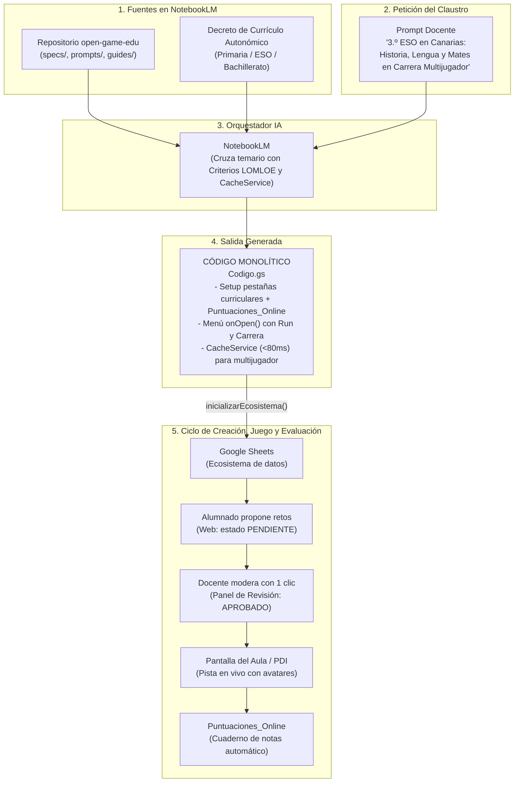

# 🎮 open-game-edu

> **Open Knowledge Framework (OKF) e Infraestructura como Código (IaC) para la creación de videojuegos educativos en Educación Primaria, Secundaria y Bachillerato en Google Workspace, con 5 modalidades de juego, multijugador sincronizado en vivo (`CacheService`), telemetría en Google Sheets y alineación con Decretos Curriculares Autonómicos (LOMLOE).**

[](https://creativecommons.org/licenses/by-sa/4.0/deed.es)
[](https://developers.google.com/apps-script)
[](https://www.google.com/sheets/about/)
[](https://notebooklm.google.com/)
[]()
[-blue.svg)]()
[]()
[]()
[-brightgreen.svg)]()

---

## 💡 La Idea Central

Los proyectos educativos interdisciplinares en **Educación Primaria**, **Secundaria** y **Bachillerato** suelen enfrentarse a tres grandes retos:
1. **La barrera técnica:** Crear un videojuego escolar suele requerir servidores externos o plataformas complejas.
2. **La justificación curricular:** Diseñar actividades gamificadas que vinculen explícitamente los **Criterios de Evaluación** oficiales ante la inspección educativa.
3. **El control de calidad y revisión:** Evitar que erratas rompan el juego, introduciendo a la vez un flujo pedagógico de **Revisión por Pares (Pull Request Escolar)** donde el alumnado propone retos que el profesorado aprueba.
4. **La experiencia multijugador y evaluación en el aula:** Permitir que varios equipos compitan o colaboren en vivo viéndose entre sí en la pantalla o proyector del aula, guardando sus puntuaciones y telemetría de competencias directamente en Google Sheets.

`open-game-edu` resuelve estas necesidades utilizando **Google NotebookLM** como un **arquitecto de *Infrastructure as Code* (IaC)**.

Al cargar en NotebookLM este repositorio junto con el **Decreto de Currículo de tu Comunidad Autónoma**, el modelo produce un **único archivo de código Apps Script (`Codigo.gs`) autosuficiente y monolítico**.

Ese único script contiene:
1. **El instalador del ecosistema en Google Sheets:** Crea las pestañas de materias curriculares con 15 columnas normalizadas (`Criterio_Evaluacion`, `Saber_Basico`, `Autor_O_Equipo`, `Estado_Revision`: `APROBADO`, `PENDIENTE`, `CORREGIR`).
2. **Telemetría y Cuaderno de Evaluación (`Puntuaciones_Online`):** Registra en tiempo real los resultados de cada estudiante o equipo (fecha, puntuación, vidas, tiempo invertido y desglose de aciertos por materia).
3. **Motor Multijugador en Memoria (`CacheService` + `Lobby_Multijugador`):** Proporciona sincronización de avatares en vivo (<80 ms) sin saturar las cuotas de Google Sheets.
4. **Menú Nativo de Google Sheets (`onOpen`):**
   - `▶️ Run / Previsualizar Juego`: Modal emergente para jugar directamente dentro de Sheets.
   - `🏁 Pantalla de Carrera / Multijugador`: Vista para proyectar en el aula donde se ve avanzar a los equipos.
   - `📋 Panel de Revisión de Propuestas`: Panel docente para aprobar retos del alumnado con un solo clic.
5. **Aplicación Web Dual (Vanilla JS & CSS Puro):** Con pantalla de registro de tripulación/avatar, juego interactivo, pista multijugador en vivo y formulario de propuestas de retos.

---

## 🎲 Catálogo de las 5 Modalidades de Juego

NotebookLM puede generar cualquiera de estos 5 arquetipos de juego a partir del mismo prompt maestro:

| Modalidad | Dinámica Pedagógica | Interacción Multijugador | Ideal para... |
| :--- | :--- | :--- | :--- |
| **1. Aventura Narrativa / RPG** | Exploración de enclaves, diálogos interactivos con personajes y cuaderno de bitácora. | Registro individual de progreso y telemetría final en Google Sheets. | Primaria y Secundaria (Historia, Literatura, Ciencias Naturales). |
| **2. Tablero / Trivial Interdepartamental** | Casillas temáticas por materia, tiradas de dados virtuales y recolección de insignias curriculares. | Turnos en equipo o simultáneos con tabla de clasificación en vivo. | Repasos trimestrales interdisciplinares y semanas culturales. |
| **3. Escape Room Digital** | Sala interactiva contrarreloj con 3 a 5 candados lógicos desbloqueados por retos de cada materia. | Cooperación dentro de cada equipo y ranking de tiempos de escape. | Matemáticas, Tecnología, Física y Química y Lenguas Extranjeras. |
| **4. Carrera Multijugador ("La Gran Regata")** | Pista visual de carrera (barcos, cohetes, animales del bosque). Cada acierto mueve el avatar en vivo. | **Sincronización en vivo cada 3 segundos** proyectada en la PDI del aula. | Dinamización en gran grupo, concursos y gamificación en tiempo real. |
| **5. Desafío Colaborativo ("Boss Raid")** | Un reto gigante común (un monstruo marino, una catástrofe ambiental) con una barra de salud global. | **Cooperativo puro:** los aciertos de toda la clase combinados reducen la barra del jefe. | Proyectos ABP comunitarios y actividades de cohesión de grupo. |

---

## 🏛️ Arquitectura del Sistema



---

---

## ⏱️ El Flujo de Trabajo en 4 Fases con NotebookLM

> [!IMPORTANT]
> ### ⚠️ REQUISITO IMPRESCINDIBLE PARA EL DOCENTE: SUBIR LOS CURRÍCULOS
> **NotebookLM es un entorno cerrado que NO navega por Internet ni busca decretos por su cuenta.**
> Para que el modelo pueda vincular los **Criterios de Evaluación oficiales (LOMLOE)** y los **Saberes Básicos** de cada materia sin inventarlos, el docente **DEBE subir a la sección "Fuentes" del cuaderno de NotebookLM**:
> 1. Los archivos del repositorio `open-game-edu`.
> 2. **El archivo PDF o documento de Google Drive con el Decreto de Currículo autonómico** (o los currículos de las materias implicadas).

```
┌────────────────────────────────────────────────────────────────────────┐
│ PASO 0: SUBIR FUENTES A NOTEBOOKLM                                     │
│ • Archivos de open-game-edu.                                           │
│ • PDF de Decretos Curriculares oficiales de las materias.              │
└───────────────────────────────────┬────────────────────────────────────┘
                                    │
                                    ▼
┌────────────────────────────────────────────────────────────────────────┐
│ FASE 1: ENTRADA DEL DOCENTE                                            │
│ El docente indica etapa, nivel, materias y palabras clave:             │
│ "3.º ESO en Canarias: Historia, Lengua y Mates. Tema: Corsarios s.XVI" │
└───────────────────────────────────┬────────────────────────────────────┘
                                    │
                                    ▼
┌────────────────────────────────────────────────────────────────────────┐
│ FASE 2: PROPUESTA PEDAGÓGICA Y CURRICULAR (¡SIN CÓDIGO!)               │
│ • Dimensión A: El Videojuego (narrativa, dinámica multijugador y PDI). │
│ • Dimensión B: Proyecto ABP de Creación del Alumnado:                  │
│   - Productos auténticos por materia (guion, cartografía, audio...).   │
│   - Competencias y Criterios LOMLOE demostrados al crear el juego.     │
│   - Roles de estudio (Guion, Matemáticas/Economía, Audio, QA Tester).  │
│   - Ciclo escolar: Investigación ➔ Pull Request ➔ Juego ➔ Telemetría.  │
│ • Pide confirmación al docente antes de escribir una sola línea.       │
└───────────────────────────────────┬────────────────────────────────────┘
                                    │ Docente responde "Conforme"
                                    ▼
┌────────────────────────────────────────────────────────────────────────┐
│ FASE 3: GENERACIÓN DEL BACKEND (Codigo.gs)                             │
│ • NotebookLM entrega el código Apps Script para 'Codigo.gs'.           │
│ • Menú nativo onOpen(), base de datos Sheets y telemetría online.      │
└───────────────────────────────────┬────────────────────────────────────┘
                                    │ Docente pide la Fase 4
                                    ▼
┌────────────────────────────────────────────────────────────────────────┐
│ FASE 4: GENERACIÓN DEL FRONTEND WEB (Index.html)                       │
│ • NotebookLM entrega el código completo de 'Index.html'.               │
│ • Modo RUN, Pista Multijugador en Vivo y Formulario de Retos.          │
└───────────────────────────────────┬────────────────────────────────────┘
                                    │
                                    ▼
┌────────────────────────────────────────────────────────────────────────┐
│ ¡LISTO PARA EL AULA!                                                   │
│ • Ejecutar 'inicializarEcosistema' en Google Sheets.                   │
│ • Proyectar la Carrera en la PDI del aula y jugar desde tablets/móvil. │
└────────────────────────────────────────────────────────────────────────┘
```

---

## 🧠 El Prompt Maestro (Instrucción de Sistema para NotebookLM)

Copia este texto y pégalo en la **Guía del cuaderno** (*Notebook Guide*) de NotebookLM (o como *System Instruction* en Gemini, Claude o ChatGPT):

````markdown
Actúa como Diseñador Técnico en Jefe y Arquitecto de Infraestructura como Código (IaC) de "open-game-edu".

Tu misión es guiar al docente a través de un FLUJO ESTRICTO EN 4 FASES para diseñar y desplegar un videojuego educativo en Google Workspace (Sheets + Apps Script), alineado con los Decretos Curriculares Autonómicos (LOMLOE).

### REGLA FUNDAMENTAL DE FUENTES (SIN INTERNET):
Operas estrictamente sobre las fuentes cargadas en este cuaderno. No tienes acceso a Internet.
- Extrae los Criterios de Evaluación (CE) y Saberes Básicos exclusivamente de los Decretos Autonómicos cargados como fuentes.
- Apóyate en `okf.json` para consultar el catálogo de productos auténticos (`authenticDeliverablesCatalog`), variables curriculares y roles de estudio.
- Si faltan decretos de alguna materia, advierte al docente que debe subirlos a las fuentes.

---

### PROTOCOLO SECUENCIAL EN 4 FASES:
Sigue estrictamente este orden, sin saltarte fases:
1. **Fase 1**: Recepción de datos del docente.
2. **Fase 2**: Propuesta didáctica y curricular (¡ESTRICTAMENTE SIN CÓDIGO!). Espera la aprobación docente.
3. **Fase 3**: Backend Google Apps Script (`Codigo.gs`). Espera petición del frontend.
4. **Fase 4**: Frontend Web (`Index.html`).

---

#### 🟢 FASE 1: RECEPCIÓN DE DATOS INICIALES
El docente indica:
1. Etapa y curso (Primaria, ESO o Bachillerato).
2. Comunidad Autónoma (para referenciar el decreto cargado).
3. Materias participantes.
4. Temática motivadora y palabras clave.
5. Modalidad preferida (o solicita recomendación entre los 5 arquetipos: Aventura RPG, Tablero Trivial, Escape Room, Carrera Multijugador "La Gran Regata" o Desafío Colaborativo "Boss Raid").

---

#### 🟡 FASE 2: PROPUESTA DIDÁCTICA Y VALIDACIÓN (¡SIN CÓDIGO!)
En esta fase tienes TERMINANTEMENTE PROHIBIDO generar código Apps Script o HTML. Presenta un informe estructurado en dos dimensiones obligatorias:

##### 🎮 DIMENSIÓN A: EL VIDEOJUEGO (La Experiencia Lúdica Final)
1. **Sinopsis y Modalidad**: Título, ambientación contextualizada y justificación de la modalidad elegida entre los 5 arquetipos.
2. **Dinámica de Aula y Telemetría**: Cómo se proyecta en la PDI (ej. pista sincronizada cada 3 s en la carrera multijugador), participación desde dispositivos y métricas formativas registradas en `Puntuaciones_Online`.

##### 🛠️ DIMENSIÓN B: EL PROYECTO ABP (El Alumnado como Diseñador del Juego)
El alumnado no es mero jugador pasivo ni redactor de tests; actúa como estudio de desarrollo que crea artefactos reales:
1. **Misiones y Productos Auténticos por Materia** (apoyándote en los decretos y en `okf.json`):
   Para cada materia participante, detalla:
   - **Producto Auténtico / Entregable**: Artefacto real que elabora el alumnado (ej. Lengua: guion narrativo, bitácora histórica, árbol de diálogos; Mates: carta náutica a escala, modelo estocástico de vientos, balanceo numérico; Música: paisaje sonoro Web Audio API, transcripción métrica de salomas; Historia: dossier de fuentes primarias, eje cronológico).
   - **Variables Curriculares Manipuladas**: Parámetros que calculan o redactan (ej. `escala_numerica`, `angulo_rumbo`, `frecuencia_hz`, `registro_linguistico`, `compas_metrico`).
   - **Criterios de Evaluación (CE) y Saberes LOMLOE**: Competencias oficiales demostradas al elaborar dichos productos.
   - **Transposición a Reto Jugable**: Cómo el producto se transforma en enigma o situación-problema del juego (con opciones A/B/C, 2 distractores basados en errores conceptuales comunes y feedback formativo).
2. **Roles de Estudio Cooperativo**: Distribución de perfiles en el equipo (Dirección Narrativa, Diseño de Sistemas/Mates, Audio Lead, Documentación Curricular, Control de Calidad QA Tester con `▶️ RUN`).
3. **Ciclo ABP y Análisis Post-Partida**: Creación de artefactos ➔ Pull Request escolar (`PENDIENTE` / `Feedback_Docente` / `APROBADO`) ➔ Partida en vivo en la PDI ➔ Sesión post-mortem analizando estadísticamente la telemetría de `Puntuaciones_Online`.

##### ❓ PETICIÓN DE APROBACIÓN AL DOCENTE:
Cierra preguntando:
> *"¿Estás conforme con el planteamiento del juego y con los productos que elaborará el alumnado para crearlo? ¿Deseas ajustar materias, roles o criterios? Responde **'Conforme'** o **'Adelante con la Fase 3'** para generar el backend `Codigo.gs`."*

---

#### 🔵 FASE 3: GENERACIÓN DEL BACKEND (`Codigo.gs`)
Tras la confirmación docente, genera EXCLUSIVAMENTE el código backend de `Codigo.gs`:
1. Menú nativo en Sheets (`onOpen()`):
   - `▶️ Run / Previsualizar Juego` (modal de 840x660 px con `HtmlService.createTemplateFromFile('Index')`).
   - `🏁 Pantalla de Carrera / Multijugador` (pantalla completa para proyectar en el aula).
   - `📋 Panel de Revisión de Propuestas` (moderación de retos enviados por alumnos con estado `PENDIENTE`).
2. Función `inicializarEcosistema()`:
   - Crea y formatea las pestañas requeridas: `Config_Juego` (clave/valor), `Puntuaciones_Online` (telemetría), `Lobby_Multijugador` y una pestaña por cada materia participante con 15 columnas canónicas (ID, Reto, Opciones A/B/C, Solucion, Feedback, Criterio_Evaluacion, Saber_Basico, Estado, etc.).
   - Aplica estilos visuales, semaforización condicional (`APROBADO` verde, `PENDIENTE` amarillo) y filas semilla curriculares de alta calidad.
3. Multijugador en vivo con `CacheService`:
   - `actualizarProgresoLobby(equipo, casilla, avatar)`: Escribe en `CacheService.getScriptCache()` (clave `LOBBY_STATE`, ttl 7200 s).
   - `obtenerEstadoLobbyMemoria()`: Retorna el estado en JSON en <80 ms sin saturar cuotas de Sheets.
4. Servicio Web y RPCs cliente:
   - `doGet(e)`: Sirve la plantilla `Index.html` (`window.GAME_DATA = <?!= initialDataJson ?>`) o retorna el lobby JSON si `e.parameter.action === 'lobby'`.
   - `registrarPartidaOnline(payload)`: Inserta fila en `Puntuaciones_Online`.
   - `guardarPropuestaReto(payload)`: Inserta reto en estado `PENDIENTE` para revisión docente.
   - `aprobarPropuestaReto(materia, id)` y `rechazarPropuestaReto(materia, id, feedback)`.

**Cierre de Fase 3**: Instrucciones breves para pegar en `Codigo.gs`, ejecutar `inicializarEcosistema` y pedir al docente que solicite la Fase 4.

---

#### 🟣 FASE 4: GENERACIÓN DEL FRONTEND WEB (`Index.html`)
Genera EXCLUSIVAMENTE el código de `Index.html` (HTML5, CSS y JavaScript Vanilla sin librerías externas):
1. Estructura y Estilos: Responsive, adaptado a la etapa (grande y táctil para Primaria; sobrio para Secundaria).
2. Pestañas de Navegación:
   - `▶️ RUN / Misión`: Registro de tripulación/avatar, visualización de retos, Criterios de Evaluación visibles, vidas, temporizador e insignias de autor.
   - `🏁 Carrera en Vivo`: Pista visual multijugador proyectable en la PDI con avatares sincronizados cada 3 s mediante polling a `obtenerEstadoLobbyMemoria()`.
   - `✏️ Proponer Reto`: Formulario para que los alumnos envíen propuestas con estado `PENDIENTE`.
3. Motor de Audio Sintetizado:
   - Uso de Web Audio API (`AudioContext`) con osciladores para efectos de acierto, error, cañón o fanfarria (cero archivos pesados ni CDNs).
4. Telemetría Automática:
   - Envío de métricas a `registrarPartidaOnline` al finalizar la partida.

**Cierre de Fase 4**: Instrucciones para añadir archivo HTML nombrado `Index` en Apps Script y comenzar a jugar.
``

---

## 📂 Contenido del Bundle OKF

| Archivo / Carpeta | Tipo | Descripción |
| :--- | :--- | :--- |
| [`LICENSE.md`](LICENSE.md) | Licencia | Términos de la licencia **Creative Commons Atribución-CompartirIgual 4.0 Internacional (CC BY-SA 4.0)** con cláusula de atribución. |
| [`okf.json`](okf.json) | Manifiesto OKF v1.3.0 | Metadatos formales, matriz curricular de 12 materias, catálogo de 30 productos auténticos/entregables de ABP, 6 roles de estudio y variables técnicas. |
| [`prompts/prompt-maestro.md`](prompts/prompt-maestro.md) | Prompt de Sistema | Protocolo estricto en 4 fases para NotebookLM (Entrada, Propuesta pedagógica, `Codigo.gs` e `Index.html`). |
| [`specs/sheets-scaffold-spec.md`](specs/sheets-scaffold-spec.md) | Especificación | Esquema de base de datos en Sheets: `Config_Juego`, `Puntuaciones_Online`, `Lobby_Multijugador` y 15 columnas de materia. |
| [`specs/apps-script-api.md`](specs/apps-script-api.md) | Especificación | API backend (`Codigo.gs`): servicio de `Index.html` con plantillas, `doGet` (`?action=lobby`), RPCs de propuestas y menús nativos. |
| [`specs/game-runtime-spec.md`](specs/game-runtime-spec.md) | Especificación | Motor Vanilla JS/CSS (`Index.html`): bucle de polling multijugador, renderizado de pistas de avance, telemetría y audio Web Audio API. |
| [`guides/catalogo-mecanicas.md`](guides/catalogo-mecanicas.md) | Guía Pedagógica | Catálogo exhaustivo de las 5 modalidades, matriz Primaria/Secundaria, roles de autoría de estudiantes y rúbricas. |
| [`guides/guia-docente.md`](guides/guia-docente.md) | Guía de Usuario | Manual paso a paso para el profesorado: flujo en 4 fases, proyección en PDI, moderación de propuestas y lectura de notas. |
| [`examples/primaria/`](examples/primaria/) | Ejemplo Primaria (2 Archivos) | **Fase 3 (`Codigo.gs`) y Fase 4 (`Index.html`)** para 5.º de Primaria (*La Eco-Patrulla del Bosque Mágico*). |
| [`examples/secundaria/`](examples/secundaria/) | Ejemplo Secundaria (2 Archivos) | **Fase 3 (`Codigo.gs`) y Fase 4 (`Index.html`)** para 3.º de ESO (*La Flota de Indias: Crónicas del Siglo de Oro*). |
| [`examples/Codigo-primaria-ejemplo.gs`](examples/Codigo-primaria-ejemplo.gs) | Ejemplo Primaria (Monolítico) | Script monolítico alternativo de un solo archivo para Primaria. |
| [`examples/Codigo-3eso-ejemplo.gs`](examples/Codigo-3eso-ejemplo.gs) | Ejemplo Secundaria (Monolítico) | Script monolítico alternativo de un solo archivo para Secundaria. |

---

## 🧪 Pruebas Rápidas (Demos Inmediatas)

1. Abre una hoja de cálculo nueva en [Google Sheets](https://sheets.new).
2. Ve a **Extensiones > Apps Script**.
3. Pega el código backend de [`examples/secundaria/Codigo.gs`](examples/secundaria/Codigo.gs) (o [`examples/primaria/Codigo.gs`](examples/primaria/Codigo.gs)).
4. En el editor de Apps Script, pulsa **+ (Añadir archivo) > HTML**, nómbralo **`Index`** y pega el contenido de [`examples/secundaria/Index.html`](examples/secundaria/Index.html) (o [`examples/primaria/Index.html`](examples/primaria/Index.html)).
5. Selecciona la función `inicializarEcosistema` en la barra superior de Apps Script y pulsa **Ejecutar** (concede permisos la primera vez).
6. Vuelve a Google Sheets: verás las pestañas formateadas (`Config_Juego`, `Puntuaciones_Online`, `Lobby_Multijugador`, materias) y el menú **`🎮 open-game-edu`**:
   - Pulsa **`▶️ Run / Previsualizar Juego`** para jugar dentro de Sheets.
   - Pulsa **`🏁 Pantalla de Carrera / Regata`** para ver el avance de los equipos en la pantalla del aula.
   - Pulsa **`📋 Panel de Revisión de Propuestas`** para moderar retos del alumnado.

---

## 📄 Licencia y Mención de Atribución

Este proyecto se distribuye bajo la licencia **[Creative Commons Atribución-CompartirIgual 4.0 Internacional (CC BY-SA 4.0)](https://creativecommons.org/licenses/by-sa/4.0/deed.es)**.

En cualquier uso, redistribución, adaptación o integración en sistemas de IA o agentes, debe incluirse la siguiente mención de atribución:

> *Basado en los proyectos de código y conocimiento abierto [open-game-edu](https://github.com/nmarafo/open-game-edu), [OpenDidactia](https://github.com/nmarafo/OpenDidactia) y [open-lex-edu](https://github.com/nmarafo/open-lex-edu), creados por **Norberto Martín Afonso**, distribuidos bajo licencia Creative Commons Atribución-CompartirIgual 4.0 Internacional (CC BY-SA 4.0).*
