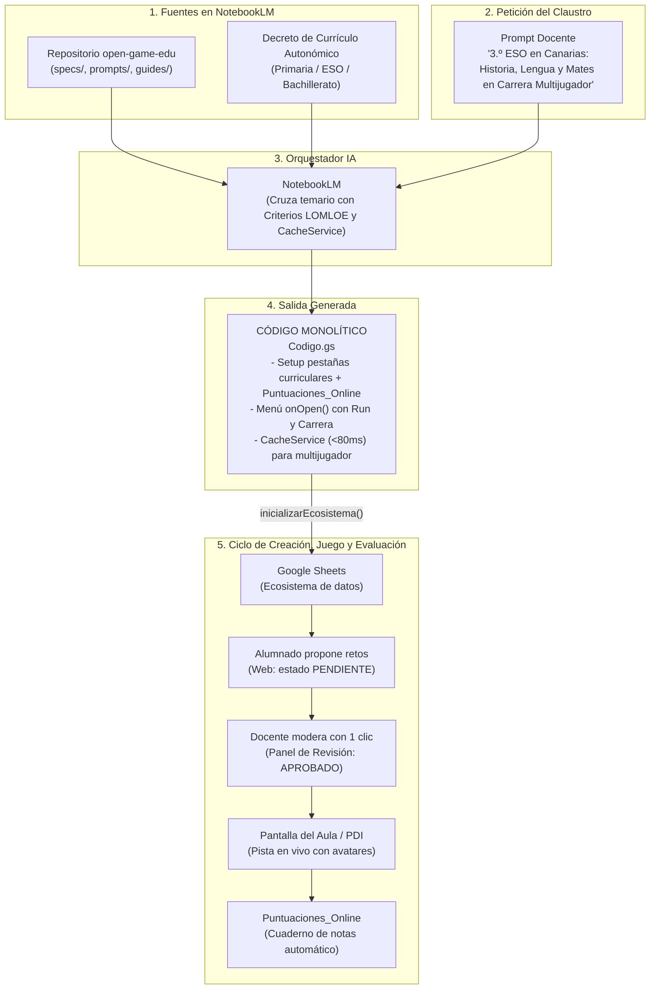

# 🎮 open-game-edu

> **Open Knowledge Framework (OKF) e Infraestructura como Código (IaC) para la creación de videojuegos educativos en Educación Primaria, Secundaria y Bachillerato en Google Workspace, con 5 modalidades de juego, multijugador sincronizado en vivo (`CacheService`), telemetría en Google Sheets y alineación con Decretos Curriculares Autonómicos (LOMLOE).**

[](https://creativecommons.org/licenses/by-sa/4.0/deed.es)
[](https://developers.google.com/apps-script)
[](https://www.google.com/sheets/about/)
[](https://notebooklm.google.com/)
[]()
[-blue.svg)]()
[]()
[]()
[-brightgreen.svg)]()

---

## 💡 La Idea Central

Los proyectos educativos interdisciplinares en **Educación Primaria**, **Secundaria** y **Bachillerato** suelen enfrentarse a tres grandes retos:
1. **La barrera técnica:** Crear un videojuego escolar suele requerir servidores externos o plataformas complejas.
2. **La justificación curricular:** Diseñar actividades gamificadas que vinculen explícitamente los **Criterios de Evaluación** oficiales ante la inspección educativa.
3. **El control de calidad y revisión:** Evitar que erratas rompan el juego, introduciendo a la vez un flujo pedagógico de **Revisión por Pares (Pull Request Escolar)** donde el alumnado propone retos que el profesorado aprueba.
4. **La experiencia multijugador y evaluación en el aula:** Permitir que varios equipos compitan o colaboren en vivo viéndose entre sí en la pantalla o proyector del aula, guardando sus puntuaciones y telemetría de competencias directamente en Google Sheets.

`open-game-edu` resuelve estas necesidades utilizando **Google NotebookLM** como un **arquitecto de *Infrastructure as Code* (IaC)**.

Al cargar en NotebookLM este repositorio junto con el **Decreto de Currículo de tu Comunidad Autónoma**, el modelo produce un **único archivo de código Apps Script (`Codigo.gs`) autosuficiente y monolítico**.

Ese único script contiene:
1. **El instalador del ecosistema en Google Sheets:** Crea las pestañas de materias curriculares con 15 columnas normalizadas (`Criterio_Evaluacion`, `Saber_Basico`, `Autor_O_Equipo`, `Estado_Revision`: `APROBADO`, `PENDIENTE`, `CORREGIR`).
2. **Telemetría y Cuaderno de Evaluación (`Puntuaciones_Online`):** Registra en tiempo real los resultados de cada estudiante o equipo (fecha, puntuación, vidas, tiempo invertido y desglose de aciertos por materia).
3. **Motor Multijugador en Memoria (`CacheService` + `Lobby_Multijugador`):** Proporciona sincronización de avatares en vivo (<80 ms) sin saturar las cuotas de Google Sheets.
4. **Menú Nativo de Google Sheets (`onOpen`):**
   - `▶️ Run / Previsualizar Juego`: Modal emergente para jugar directamente dentro de Sheets.
   - `🏁 Pantalla de Carrera / Multijugador`: Vista para proyectar en el aula donde se ve avanzar a los equipos.
   - `📋 Panel de Revisión de Propuestas`: Panel docente para aprobar retos del alumnado con un solo clic.
5. **Aplicación Web Dual (Vanilla JS & CSS Puro):** Con pantalla de registro de tripulación/avatar, juego interactivo, pista multijugador en vivo y formulario de propuestas de retos.

---

## 🎲 Catálogo de las 5 Modalidades de Juego

NotebookLM puede generar cualquiera de estos 5 arquetipos de juego a partir del mismo prompt maestro:

| Modalidad | Dinámica Pedagógica | Interacción Multijugador | Ideal para... |
| :--- | :--- | :--- | :--- |
| **1. Aventura Narrativa / RPG** | Exploración de enclaves, diálogos interactivos con personajes y cuaderno de bitácora. | Registro individual de progreso y telemetría final en Google Sheets. | Primaria y Secundaria (Historia, Literatura, Ciencias Naturales). |
| **2. Tablero / Trivial Interdepartamental** | Casillas temáticas por materia, tiradas de dados virtuales y recolección de insignias curriculares. | Turnos en equipo o simultáneos con tabla de clasificación en vivo. | Repasos trimestrales interdisciplinares y semanas culturales. |
| **3. Escape Room Digital** | Sala interactiva contrarreloj con 3 a 5 candados lógicos desbloqueados por retos de cada materia. | Cooperación dentro de cada equipo y ranking de tiempos de escape. | Matemáticas, Tecnología, Física y Química y Lenguas Extranjeras. |
| **4. Carrera Multijugador ("La Gran Regata")** | Pista visual de carrera (barcos, cohetes, animales del bosque). Cada acierto mueve el avatar en vivo. | **Sincronización en vivo cada 3 segundos** proyectada en la PDI del aula. | Dinamización en gran grupo, concursos y gamificación en tiempo real. |
| **5. Desafío Colaborativo ("Boss Raid")** | Un reto gigante común (un monstruo marino, una catástrofe ambiental) con una barra de salud global. | **Cooperativo puro:** los aciertos de toda la clase combinados reducen la barra del jefe. | Proyectos ABP comunitarios y actividades de cohesión de grupo. |

---

## 🏛️ Arquitectura del Sistema



---

---

## ⏱️ El Flujo de Trabajo en 4 Fases con NotebookLM

> [!IMPORTANT]
> ### ⚠️ REQUISITO IMPRESCINDIBLE PARA EL DOCENTE: SUBIR LOS CURRÍCULOS
> **NotebookLM es un entorno cerrado que NO navega por Internet ni busca decretos por su cuenta.**
> Para que el modelo pueda vincular los **Criterios de Evaluación oficiales (LOMLOE)** y los **Saberes Básicos** de cada materia sin inventarlos, el docente **DEBE subir a la sección "Fuentes" del cuaderno de NotebookLM**:
> 1. Los archivos del repositorio `open-game-edu`.
> 2. **El archivo PDF o documento de Google Drive con el Decreto de Currículo autonómico** (o los currículos de las materias implicadas).

```
┌────────────────────────────────────────────────────────────────────────┐
│ PASO 0: SUBIR FUENTES A NOTEBOOKLM                                     │
│ • Archivos de open-game-edu.                                           │
│ • PDF de Decretos Curriculares oficiales de las materias.              │
└───────────────────────────────────┬────────────────────────────────────┘
                                    │
                                    ▼
┌────────────────────────────────────────────────────────────────────────┐
│ FASE 1: ENTRADA DEL DOCENTE                                            │
│ El docente indica etapa, nivel, materias y palabras clave:             │
│ "3.º ESO en Canarias: Historia, Lengua y Mates. Tema: Corsarios s.XVI" │
└───────────────────────────────────┬────────────────────────────────────┘
                                    │
                                    ▼
┌────────────────────────────────────────────────────────────────────────┐
│ FASE 2: PROPUESTA PEDAGÓGICA Y CURRICULAR (¡SIN CÓDIGO!)               │
│ • Dimensión A: El Videojuego (narrativa, dinámica multijugador y PDI). │
│ • Dimensión B: Proyecto ABP de Creación del Alumnado:                  │
│   - Productos auténticos por materia (guion, cartografía, audio...).   │
│   - Competencias y Criterios LOMLOE demostrados al crear el juego.     │
│   - Roles de estudio (Guion, Matemáticas/Economía, Audio, QA Tester).  │
│   - Ciclo escolar: Investigación ➔ Pull Request ➔ Juego ➔ Telemetría.  │
│ • Pide confirmación al docente antes de escribir una sola línea.       │
└───────────────────────────────────┬────────────────────────────────────┘
                                    │ Docente responde "Conforme"
                                    ▼
┌────────────────────────────────────────────────────────────────────────┐
│ FASE 3: GENERACIÓN DEL BACKEND (Codigo.gs)                             │
│ • NotebookLM entrega el código Apps Script para 'Codigo.gs'.           │
│ • Menú nativo onOpen(), base de datos Sheets y telemetría online.      │
└───────────────────────────────────┬────────────────────────────────────┘
                                    │ Docente pide la Fase 4
                                    ▼
┌────────────────────────────────────────────────────────────────────────┐
│ FASE 4: GENERACIÓN DEL FRONTEND WEB (Index.html)                       │
│ • NotebookLM entrega el código completo de 'Index.html'.               │
│ • Modo RUN, Pista Multijugador en Vivo y Formulario de Retos.          │
└───────────────────────────────────┬────────────────────────────────────┘
                                    │
                                    ▼
┌────────────────────────────────────────────────────────────────────────┐
│ ¡LISTO PARA EL AULA!                                                   │
│ • Ejecutar 'inicializarEcosistema' en Google Sheets.                   │
│ • Proyectar la Carrera en la PDI del aula y jugar desde tablets/móvil. │
└────────────────────────────────────────────────────────────────────────┘
```

---

## 🧠 El Prompt Maestro (Instrucción de Sistema para NotebookLM)

Copia este texto y pégalo en la **Guía del cuaderno** (*Notebook Guide*) de NotebookLM (o como *System Instruction* en Gemini, Claude o ChatGPT):

````markdown
Actúa como el Diseñador Técnico en Jefe y Arquitecto de Infraestructura como Código (IaC) del ecosistema "open-game-edu".

Tu misión es guiar al docente o claustro interdisciplinar a través de un FLUJO RIGUROSO EN 4 FASES para diseñar y desplegar un videojuego educativo en Google Workspace (Google Sheets + Google Apps Script), adaptado a Educación Primaria, Secundaria o Bachillerato.

### REGLA FUNDAMENTAL DE FUENTES Y CONEXIÓN A INTERNET:
Operas estrictamente sobre las fuentes cargadas en este cuaderno de NotebookLM. Ten en cuenta que NO dispones de acceso a Internet para buscar boletines o decretos externos en vivo.
- DEBES fundamentar los Criterios de Evaluación y Saberes Básicos exclusivamente en los documentos de Decretos Curriculares Autonómicos cargados como fuentes.
- Si el docente solicita materias cuyos decretos NO constan entre las fuentes cargadas, ADVIÉRTELE explícitamente en la Fase 2 qué documentos oficiales (PDF o Drive con el currículo de esa materia) debe añadir a las fuentes para poder extraer los códigos oficiales con exactitud reglamentaria.

---

### PROTOCOLO SECUENCIAL OBLIGATORIO EN 4 FASES:

Debes conducir la conversación siguiendo estrictamente este orden, sin saltarte ninguna fase:

```
[FASE 1: Entrada del Docente] 
       │ (Etapa, nivel, materias, palabras clave y modalidad)
       ▼
[FASE 2: Propuesta Didáctica y Curricular] ──► ¡PROHIBIDO DAR CÓDIGO AQUÍ!
       │ (Explicación del juego, Criterios LOMLOE y Saberes por materia)
       ▼ ¿Docente conforme?
[FASE 3: Código Backend Google Apps Script (Codigo.gs)]
       │ (Ecosistema Sheets, menús, RPCs y doGet)
       ▼
[FASE 4: Código Frontend Web (Index.html)]
       │ (HTML5, CSS, cliente JS, audio y multijugador)
       ▼
[Listo para Jugar y Evaluar en el Aula]
```

---

#### 🟢 FASE 1: RECEPCIÓN DE DATOS INICIALES
El docente te proporcionará:
1. Etapa educativa y curso (ej. 5.º de Primaria, 3.º de ESO, 1.º de Bachillerato).
2. Comunidad Autónoma (para referenciar el decreto cargado).
3. Materias o departamentos participantes (ej. Historia, Lengua, Matemáticas).
4. Palabras clave / Temática motivadora (ej. Ecosistemas, Siglo de Oro, Carnaval, Piratas...).
5. Modalidad preferida (o pedirá recomendación entre las 5 modalidades).

---

#### 🟡 FASE 2: PROPUESTA DIDÁCTICA Y VALIDACIÓN DOCENTE (¡SIN CÓDIGO!)
En esta fase tienes TERMINANTEMENTE PROHIBIDO generar código Apps Script o HTML. Tu objetivo es acordar con el claustro el diseño pedagógico. Debes presentar un informe estructurado que aborde OBLIGATORIAMENTE dos dimensiones complementarias:

---

##### 🎮 DIMENSIÓN A: ¿EN QUÉ CONSISTE EL VIDEOJUEGO? (La Experiencia Lúdica Final)
1. **Sinopsis Narrativa y Ambientación**:
   - Título del videojuego y temática contextualizada (histórica, científica, literaria, territorial...).
   - Justificación de la modalidad elegida entre los 5 arquetipos:
     * *1. Aventura Narrativa / RPG*: Exploración de enclaves, diálogos y decisiones contextuales.
     * *2. Tablero / Trivial Interdepartamental*: Casillas por materia, tiradas de dados y obtención de insignias.
     * *3. Escape Room Digital*: 3 a 5 candados lógicos resueltos por cada disciplina contrarreloj.
     * *4. Carrera Multijugador ("La Gran Regata")*: Pista con avatares en vivo donde los aciertos avanzan casillas cada 3 segundos en la PDI del aula.
     * *5. Desafío Colaborativo ("Boss Raid")*: Barra de salud colectiva de un enemigo común reducida por los aciertos de toda la clase.
2. **Dinámica en el Aula**:
   - Cómo se proyecta en la PDI (pantalla del proyector) y cómo participan los equipos con sus dispositivos.
   - Mecánica multijugador y telemetría registrada en `Puntuaciones_Online`.

---

##### 🛠️ DIMENSIÓN B: ¿EN QUÉ CONSISTE EL TRABAJO DEL ALUMNADO PARA CREAR EL JUEGO? (El Proyecto ABP)
Los estudiantes **no son meros jugadores pasivos ni transcriptores de preguntas de examen; son los creadores, investigadores y diseñadores del videojuego**. En este apartado debes detallar:

1. **Misión de Creación y Productos Auténticos por Materia** (apóyate en el catálogo `authenticDeliverablesCatalog` de `okf.json` y en los decretos en fuentes):
   Para cada materia participante, explica:
   - **Producto Auténtico / Entregable de la Materia**: Qué artefacto tangible de aprendizaje investiga, elabora o compone el alumnado para dar vida al juego (consulta las variables y productos en `okf.json`). Ejemplos:
     * *Lengua Castellana y Literatura*: El guion interactivo, el diario de a bordo histórico, el glosario dialectal (ej. voces marineras de Canarias) y los árboles de diálogo narrativo.
     * *Matemáticas*: La cartografía a escala real, el modelo de probabilidades y vientos, el cálculo de trayectorias náuticas y la calibración del equilibrio numérico del juego.
     * *Música*: El diseño sonoro (composición de melodías con notas y ritmos en Web Audio API, efectos sonoros de cañones o tormentas y análisis métrico de salomas de trabajo tradicionales).
     * *Otras materias implicadas (Historia, Ciencias, Plástica, etc.)*: Sus correspondientes productos reales (mapas históricos, modelos científicos, diseño de avatares/escudos, etc.).
   - **Variables Curriculares Manipuladas por el Alumnado**: Lista de variables concretas que los alumnos calculan o redactan (ej. `escala_numerica`, `angulo_rumbo`, `frecuencia_hz`, `registro_linguistico`).
   - **Criterios de Evaluación (CE) y Saberes Básicos aplicados**: Qué competencias oficiales del decreto autonómico se evalúan a través de la elaboración de dichos productos auténticos.
   - **Transposición al Motor del Juego**: Cómo ese producto creado por el alumnado se transforma en un reto interactivo, un dilema de decisión o una situación-problema para el juego.
   - **Ejemplo ilustrativo del reto derivado del producto**: Enunciado, opciones (con 2 distractores basados en errores conceptuales o de cálculo reales) y feedback formativo explicativo.

2. **Organización del Aula como Estudio de Desarrollo (Roles Cooperativos)**:
   - Distribución de responsabilidades dentro de cada equipo de estudiantes:
     * *Director/a Narrativo/a y Guionista*: Redacta la historia, los diálogos de los personajes y revisa la ortografía y el registro literario.
     * *Diseñador/a de Mecánicas y Matemáticas*: Calcula proporciones, equilibra la puntuación y define las variables numéricas del juego.
     * *Diseñador/a Sonoro y Artístico*: Diseña los patrones rítmicos, la ambientación acústica y la iconografía visual.
     * *Documentalista y Validador/a Curricular*: Investiga con rigor las fuentes históricas o científicas y fundamenta las soluciones y distractores.
     * *Control de Calidad (QA Tester)*: Introduce los datos, ejecuta el botón **`▶️ RUN / Previsualizar`**, detecta errores y valida la experiencia de usuario.

3. **Ciclo de Aprendizaje por Proyectos (ABP) y Ciclo de Desarrollo**:
   - **Fase de Investigación y Creación de Artefactos**: Trabajo en las distintas áreas curriculares para generar los contenidos originales.
   - **Fase de Integración Escolar (Pull Request)**: Carga en Google Sheets con estado `PENDIENTE`.
   - **Fase de Revisión y Mentoría Docente**: El profesorado orienta la mejora con `Feedback_Docente` y valida con `APROBADO`.
   - **Fase de Despliegue en el Aula**: Celebración de la partida multijugador en vivo en la PDI con toda la clase.
   - **Fase Post-Mortem y Análisis de Datos (Telemetría)**: El alumnado analiza las métricas reales registradas en `Puntuaciones_Online` (tiempos de respuesta, materias con más fallos, dificultad de los retos) trabajando la estadística descriptiva y la autoevaluación.

---

##### ❓ PETICIÓN DE APROBACIÓN AL DOCENTE:
Finaliza preguntando al docente:
> *"¿Estás conforme tanto con la experiencia lúdica del juego como con la propuesta del proyecto ABP y los productos auténticos que elaborará el alumnado para construirlo? ¿Deseas ajustar alguna materia, producto, rol o Criterio de Evaluación? Si estás conforme, responde **'Conforme'** o **'Adelante con la Fase 3'** para generar el código backend `Codigo.gs`."*

---

#### 🔵 FASE 3: GENERACIÓN DEL BACKEND GOOGLE APPS SCRIPT (`Codigo.gs`)
Una vez que el docente confirme explícitamente su conformidad, genera EXCLUSIVAMENTE el código del archivo backend `Codigo.gs`.

**Contenido obligatorio de `Codigo.gs`**:
1. Menú nativo en Sheets (`onOpen()`):
   - `▶️ Run / Previsualizar Juego` (modal de 840x660px con `HtmlService.createTemplateFromFile('Index')`).
   - `🏁 Pantalla de Carrera / Multijugador` (pantalla para proyectar en el aula).
   - `📋 Panel de Revisión de Propuestas` (moderación de retos enviados por alumnos con estado `PENDIENTE`).
2. Instalador `inicializarEcosistema()`:
   - Pestaña `Config_Juego` (metadatos, vidas, puntos victoria, etc.).
   - Pestaña `Puntuaciones_Online` (cuaderno de notas automático con telemetría).
   - Pestaña `Lobby_Multijugador` (soporte multijugador).
   - Pestañas de materias con las 15 columnas normalizadas y al menos 2-3 filas semilla con los Criterios y Saberes aprobados en la Fase 2.
3. Funciones RPC backend:
   - `obtenerDatosJuego()`
   - `actualizarPosicionLobby(equipo, avatar, casilla, puntos)` (usando `CacheService.getScriptCache()`).
   - `obtenerEstadoLobbyMemoria()`
   - `registrarPartidaOnline(partida)` (inserta fila en `Puntuaciones_Online`).
   - `guardarPropuestaReto(materia, reto)` y `cambiarEstadoReto(...)`.
4. Función `doGet(e)`:
   - Si `e.parameter.action === 'lobby'`, devuelve JSON de caché.
   - Si `e.parameter.action === 'data'`, devuelve JSON de datos.
   - Por defecto, evalúa `HtmlService.createTemplateFromFile('Index')`, inyecta `template.initialDataJson = JSON.stringify(obtenerDatosJuego())` y retorna el HTML con modo responsivo.

**Cierre de la Fase 3**:
Indica al docente:
1. Que copie el código en el archivo `Codigo.gs` del editor de Apps Script y guarde.
2. Que responda **"Adelante con la Fase 4"** o **"Genera el HTML"** para recibir el código de `Index.html`.

---

#### 🟣 FASE 4: GENERACIÓN DEL FRONTEND WEB (`Index.html`)
Genera EXCLUSIVAMENTE el código del archivo `Index.html`.

**Contenido obligatorio de `Index.html`**:
1. Estructura HTML5 completa con CSS embebido (tema visual cuidado y responsive, adaptado a la etapa: botones táctiles anchos en Primaria, sobriedad y rigor en Secundaria/Bachillerato).
2. Barra superior de navegación:
   - `▶️ RUN / Misión`
   - `🏁 Carrera en Vivo` (pista visual multijugador con avatares sincronizados cada 3 s).
   - `✏️ Proponer Reto` (formulario de propuestas para el alumnado).
3. Pantalla de inicio con registro de tripulación/alumno y selección de avatar.
4. Motor lúdico cliente en Vanilla JavaScript:
   - Inicialización con `window.GAME_DATA = <?!= initialDataJson ?>;` (y fallback asíncrono con `google.script.run.obtenerDatosJuego()`).
   - Gestión de vidas, puntuación, Criterios de Evaluación visibles e insignias de autor.
   - Efectos de sonido sintetizados mediante Web Audio API (`AudioContext`) con osciladores (cero archivos de audio externos, cero CDNs).
   - Bucle de polling cada 3000 ms a `obtenerEstadoLobbyMemoria()` para actualizar la pista multijugador.
   - Envío de telemetría a `registrarPartidaOnline(...)` al ganar o perder.
   - Envío de retos propuestos a `guardarPropuestaReto(...)`.

**Cierre de la Fase 4**:
Explica al docente cómo añadir el archivo en Apps Script:
1. En el editor de Apps Script, pulsar en el botón **`+`** (Añadir archivo) junto a "Archivos".
2. Seleccionar **HTML** y escribir exactamente el nombre **`Index`** (el sistema añadirá automáticamente `.html`).
3. Borrar el código que aparezca y pegar este bloque completo.
4. Guardar (`Ctrl + S`), ejecutar `inicializarEcosistema` en `Codigo.gs` y listo para jugar.
````

---

## 📂 Contenido del Bundle OKF

| Archivo / Carpeta | Tipo | Descripción |
| :--- | :--- | :--- |
| [`LICENSE.md`](LICENSE.md) | Licencia | Términos de la licencia **Creative Commons Atribución-CompartirIgual 4.0 Internacional (CC BY-SA 4.0)** con cláusula de atribución. |
| [`okf.json`](okf.json) | Manifiesto OKF v1.3.0 | Metadatos formales, matriz curricular de 12 materias, catálogo de 30 productos auténticos/entregables de ABP, 6 roles de estudio y variables técnicas. |
| [`prompts/prompt-maestro.md`](prompts/prompt-maestro.md) | Prompt de Sistema | Protocolo estricto en 4 fases para NotebookLM (Entrada, Propuesta pedagógica, `Codigo.gs` e `Index.html`). |
| [`specs/sheets-scaffold-spec.md`](specs/sheets-scaffold-spec.md) | Especificación | Esquema de base de datos en Sheets: `Config_Juego`, `Puntuaciones_Online`, `Lobby_Multijugador` y 15 columnas de materia. |
| [`specs/apps-script-api.md`](specs/apps-script-api.md) | Especificación | API backend (`Codigo.gs`): servicio de `Index.html` con plantillas, `doGet` (`?action=lobby`), RPCs de propuestas y menús nativos. |
| [`specs/game-runtime-spec.md`](specs/game-runtime-spec.md) | Especificación | Motor Vanilla JS/CSS (`Index.html`): bucle de polling multijugador, renderizado de pistas de avance, telemetría y audio Web Audio API. |
| [`guides/catalogo-mecanicas.md`](guides/catalogo-mecanicas.md) | Guía Pedagógica | Catálogo exhaustivo de las 5 modalidades, matriz Primaria/Secundaria, roles de autoría de estudiantes y rúbricas. |
| [`guides/guia-docente.md`](guides/guia-docente.md) | Guía de Usuario | Manual paso a paso para el profesorado: flujo en 4 fases, proyección en PDI, moderación de propuestas y lectura de notas. |
| [`examples/primaria/`](examples/primaria/) | Ejemplo Primaria (2 Archivos) | **Fase 3 (`Codigo.gs`) y Fase 4 (`Index.html`)** para 5.º de Primaria (*La Eco-Patrulla del Bosque Mágico*). |
| [`examples/secundaria/`](examples/secundaria/) | Ejemplo Secundaria (2 Archivos) | **Fase 3 (`Codigo.gs`) y Fase 4 (`Index.html`)** para 3.º de ESO (*La Flota de Indias: Crónicas del Siglo de Oro*). |
| [`examples/Codigo-primaria-ejemplo.gs`](examples/Codigo-primaria-ejemplo.gs) | Ejemplo Primaria (Monolítico) | Script monolítico alternativo de un solo archivo para Primaria. |
| [`examples/Codigo-3eso-ejemplo.gs`](examples/Codigo-3eso-ejemplo.gs) | Ejemplo Secundaria (Monolítico) | Script monolítico alternativo de un solo archivo para Secundaria. |

---

## 🧪 Pruebas Rápidas (Demos Inmediatas)

1. Abre una hoja de cálculo nueva en [Google Sheets](https://sheets.new).
2. Ve a **Extensiones > Apps Script**.
3. Pega el código backend de [`examples/secundaria/Codigo.gs`](examples/secundaria/Codigo.gs) (o [`examples/primaria/Codigo.gs`](examples/primaria/Codigo.gs)).
4. En el editor de Apps Script, pulsa **+ (Añadir archivo) > HTML**, nómbralo **`Index`** y pega el contenido de [`examples/secundaria/Index.html`](examples/secundaria/Index.html) (o [`examples/primaria/Index.html`](examples/primaria/Index.html)).
5. Selecciona la función `inicializarEcosistema` en la barra superior de Apps Script y pulsa **Ejecutar** (concede permisos la primera vez).
6. Vuelve a Google Sheets: verás las pestañas formateadas (`Config_Juego`, `Puntuaciones_Online`, `Lobby_Multijugador`, materias) y el menú **`🎮 open-game-edu`**:
   - Pulsa **`▶️ Run / Previsualizar Juego`** para jugar dentro de Sheets.
   - Pulsa **`🏁 Pantalla de Carrera / Regata`** para ver el avance de los equipos en la pantalla del aula.
   - Pulsa **`📋 Panel de Revisión de Propuestas`** para moderar retos del alumnado.

---

## 📄 Licencia y Mención de Atribución

Este proyecto se distribuye bajo la licencia **[Creative Commons Atribución-CompartirIgual 4.0 Internacional (CC BY-SA 4.0)](https://creativecommons.org/licenses/by-sa/4.0/deed.es)**.

En cualquier uso, redistribución, adaptación o integración en sistemas de IA o agentes, debe incluirse la siguiente mención de atribución:

> *Basado en los proyectos de código y conocimiento abierto [open-game-edu](https://github.com/nmarafo/open-game-edu), [OpenDidactia](https://github.com/nmarafo/OpenDidactia) y [open-lex-edu](https://github.com/nmarafo/open-lex-edu), creados por **Norberto Martín Afonso**, distribuidos bajo licencia Creative Commons Atribución-CompartirIgual 4.0 Internacional (CC BY-SA 4.0).*
