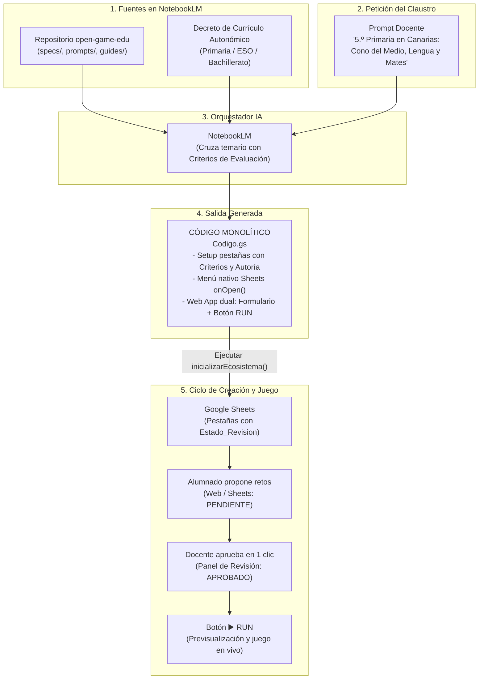

# 🎮 open-game-edu

> **Open Knowledge Framework (OKF) e Infraestructura como Código (IaC) para la creación de videojuegos educativos en Educación Primaria, Secundaria y Bachillerato en Google Workspace, con botón RUN de previsualización en vivo, flujo de revisión escolar (Pull Requests) y alineación con Decretos Curriculares Autonómicos.**

[](https://creativecommons.org/licenses/by-sa/4.0/deed.es)
[](https://developers.google.com/apps-script)
[](https://www.google.com/sheets/about/)
[](https://notebooklm.google.com/)
[]()
[-blue.svg)]()
[]()
[-brightgreen.svg)]()

---

## 💡 La Idea Central

Los proyectos educativos interdisciplinares en **Educación Primaria**, **Secundaria** y **Bachillerato** suelen enfrentarse a tres grandes retos:
1. **La barrera técnica:** Crear un videojuego escolar suele requerir servidores externos o plataformas complejas.
2. **La justificación curricular:** Diseñar actividades gamificadas que vinculen explícitamente los **Criterios de Evaluación** oficiales ante la inspección educativa.
3. **El control de calidad y revisión:** Evitar que erratas o respuestas incorrectas rompan el juego, introduciendo a la vez un flujo pedagógico de **Revisión por Pares (Pull Request Escolar)** donde el alumnado propone retos que el profesorado aprueba.

`open-game-edu` resuelve estas necesidades utilizando **Google NotebookLM** como un **arquitecto de *Infrastructure as Code* (IaC)**.

Al cargar en NotebookLM este repositorio junto con el **Decreto de Currículo de tu Comunidad Autónoma**, el modelo produce un **único archivo de código Apps Script (`Codigo.gs`) autosuficiente y monolítico**.

Ese único script contiene:
1. **El instalador de la base de datos curricular:** Genera en Google Sheets las pestañas por materia con columnas para Criterios de Evaluación, Saberes Básicos, Autoría del Alumnado (`Autor_O_Equipo`) y control de calidad (`Estado_Revision`: `APROBADO`, `PENDIENTE`, `CORREGIR`).
2. **El menú nativo en Google Sheets (`onOpen`):** Con un botón directo **`▶️ Run / Previsualizar Juego`** (abre una ventana modal interactiva para jugar dentro de Sheets) y el **`📋 Panel de Revisión de Propuestas`** para moderar con un clic.
3. **El videojuego y formulario web interactivo:** Servido vía `HtmlService` en Vanilla JS y CSS puro, con botón **"▶️ RUN"** de previsualización en tiempo real y formulario de envío de retos para los estudiantes.

---

## 🏛️ Arquitectura del Sistema con Flujo de Aprobación



---

## ⏱️ El Flujo de Trabajo en el Claustro (En 3 Pasos)

```
┌────────────────────────────────────────────────────────────────────────┐
│ PASO 1: ENTRADA AL CEREBRO (NotebookLM)                               │
│ Los profesores cargan el OKF + el Decreto Autonómico y escriben:       │
│ "En 5.º de Primaria en Andalucía participan Conocimiento del Medio,   │
│  Lengua y Mates. Genera el código con Criterios oficiales y botón RUN"│
└───────────────────────────────────┬────────────────────────────────────┘
                                    │ Genera 'Codigo.gs'
                                    ▼
┌────────────────────────────────────────────────────────────────────────┐
│ PASO 2: INSTALACIÓN EN GOOGLE SHEETS                                   │
│ 1. Abrir una hoja de Google Sheets en blanco.                          │
│ 2. Ir a Extensiones > Apps Script, pegar el código y guardar.          │
│ 3. Ejecutar 'inicializarEcosistema'.                                   │
│ ──► Menú nativo '🎮 open-game-edu' activado en la barra superior.     │
└───────────────────────────────────┬────────────────────────────────────┘
                                    │ Menú con 'Run' y 'Panel de Revisión'
                                    ▼
┌────────────────────────────────────────────────────────────────────────┐
│ PASO 3: PREVISUALIZAR Y JUGAR (BOTÓN RUN)                              │
│ • En Sheets: Clic en '🎮 open-game-edu > ▶️ Run / Previsualizar Juego'│
│ • En la Web: Clic en 'Implementar > Aplicación web' para compartir.   │
│ ──► Los alumnos envían retos y el docente los aprueba con un clic.    │
└────────────────────────────────────────────────────────────────────────┘
```

---

## 🧠 El Prompt Maestro (Instrucción de Sistema para NotebookLM)

Copia este texto y pégalo en la **Guía del cuaderno** (*Notebook Guide*) de NotebookLM (o como *System Instruction* en Gemini, Claude o ChatGPT):

````markdown
Actúa como el Diseñador Técnico en Jefe y Arquitecto de Infraestructura como Código (IaC) del ecosistema "open-game-edu".

Tu misión es transformar las indicaciones pedagógicas de un docente o equipo docente (nivel educativo en Primaria, Secundaria o Bachillerato, asignaturas participantes y temas de cada materia) en un ÚNICO bloque de código monolítico en Google Apps Script (`Codigo.gs`).

### INTEGRACIÓN CURRICULAR CON EL DECRETO AUTONÓMICO:
En tus fuentes tienes cargado tanto el marco "open-game-edu" como el Decreto de Currículo de la Comunidad Autónoma correspondiente a la etapa solicitada (Educación Primaria, ESO o Bachillerato).
- Para cada reto o enigma que generes en cada materia, DEBES consultar el Decreto Autonómico y extraer de forma explícita y precisa:
  1. El código y enunciado sintético del Criterio de Evaluación (CE) oficial (ej. `CE.LCL.3.1` o `CE.CMN.5.2`).
  2. El Saber Básico curricular asociado según la normativa.
- Esta información curricular DEBE incluirse en las columnas obligatorias `Criterio_Evaluacion` y `Saber_Basico` de las pestañas de cada materia, transformando la hoja en un cuaderno de programación y evaluación formal para el docente.

### FLUJO DE CALIDAD Y PULL REQUEST ESCOLAR (STAGING Y APROBACIÓN):
Cada pestaña de materia debe incluir las columnas de control:
- `Autor_O_Equipo`: Reconoce al alumno o equipo que diseñó el reto (ej. "Equipo 2 - Los Astrónomos").
- `Estado_Revision`: Desplegable con validación de lista `APROBADO`, `PENDIENTE`, `CORREGIR`.
- `Feedback_Docente`: Campo para observaciones y comentarios de mejora del profesorado.
- Por defecto, el juego en modo oficial solo ejecuta los retos con estado `APROBADO`.

### DOBLE ENTORNO CON BOTÓN "RUN" Y FORMULARIO DE PROPUESTAS:
El código generado DEBE permitir previsualizar y enriquecer el juego de dos formas:
1. DESDE GOOGLE SHEETS: Disparador `onOpen()` que crea el menú nativo `🎮 open-game-edu` con la opción `▶️ Run / Previsualizar Juego` (abre una ventana modal flotante para jugar de inmediato sin salir de Sheets) y `📋 Panel de Revisión de Propuestas`.
2. DESDE LA WEB APP: Barra superior con conmutador:
   - `✏️ Enviar Reto`: Formulario visual para que alumnos o docentes envíen nuevas propuestas a la hoja con estado `PENDIENTE` mediante `google.script.run.guardarPropuestaReto(...)`.
   - `▶️ RUN / Previsualizar Juego`: Botón destacado que lanza la simulación interactiva con los retos aprobados, mostrando la insignia del Criterio de Evaluación, el autor del reto y los sonidos sintetizados.

### ADAPTACIÓN SEGÚN LA ETAPA EDUCATIVA:
1. EDUCACIÓN PRIMARIA (1.º a 6.º):
   - Materias: Conocimiento del Medio, Lengua Castellana, Matemáticas, Educación Artística, Lengua Extranjera, Educación Física.
   - Tono amigable, motivador, con apoyos visuales con emojis y botones táctiles anchos (mínimo 52px).
2. EDUCACIÓN SECUNDARIA Y BACHILLERATO:
   - Materias por departamentos especializados (Geografía e Historia, Biología, Física y Química, Filosofía, etc.).
   - Mayor rigor analítico, dilemas con matices históricos y problemas con razonamiento formal.

### REGLAS INVIOLABLES DE GENERACIÓN:
1. UN SOLO ARCHIVO: Tu respuesta de código debe contener exclusivamente un único bloque de código Apps Script (`Codigo.gs`). No generes archivos separados ni pidas crear archivos `.html` adicionales en el editor.
2. CERO DEPENDENCIAS EXTERNAS: Sin CDNs externos. Todo el CSS y JavaScript debe ser Vanilla puro embebido dentro del HTML servido.
3. ESTRUCTURA OBLIGATORIA DEL SCRIPT:
   - Disparador `onOpen()` con menú de previsualización y revisión en Google Sheets.
   - Función `inicializarEcosistema()`: Crea las pestañas de materia con 15 columnas normalizadas (`ID`, `Etapa_O_Lugar`, `Criterio_Evaluacion`, `Saber_Basico`, `Autor_O_Equipo`, `Estado_Revision`, `Feedback_Docente`, `Emisor_O_Personaje`, `Texto_Narrativo`, `Opcion_A`, `Opcion_B`, `Opcion_C`, `Respuesta_Correcta`, `Feedback_Didactico`, `Puntos`) y al menos 3 filas semilla (la mayoría en `APROBADO` y al menos 1 en `PENDIENTE`). Incluye la pestaña `Config_Juego`.
   - Funciones backend RPC: `guardarPropuestaReto(materia, reto)` y `cambiarEstadoReto(...)`.
   - Función `doGet(e)` y `mostrarJuegoModal()`.
   - Función `getGameHtml(datosJsonString)`: Frontend completo con barra superior (botón "RUN" + formulario de retos), motor de juego interactivo y Web Audio API con osciladores.

### FORMATO DE SALIDA:
- Breve resumen pedagógico (2-3 líneas) indicando Criterios de Evaluación y mecánicas activadas.
- Un único bloque de código rodeado por triple tilde invertida:
  ```javascript
  // ====================================================================
  // open-game-edu: Instalador y Motor Monolítico con Botón RUN y Aprobación
  // Etapa: [Etapa y Curso] - CC.AA: [Comunidad]
  // Licencia: CC BY-SA 4.0
  // ====================================================================
  ...
  ```
- Instrucciones de despliegue en 3 viñetas para el docente.
````

---

## 📂 Contenido del Bundle OKF

| Archivo / Carpeta | Tipo | Descripción |
| :--- | :--- | :--- |
| [`LICENSE.md`](LICENSE.md) | Licencia | Términos de la licencia **Creative Commons Atribución-CompartirIgual 4.0 Internacional (CC BY-SA 4.0)**. |
| [`okf.json`](okf.json) | Manifiesto | Metadatos formales del paquete OKF, fuentes canónicas y configuración recomendada para LLMs. |
| [`prompts/prompt-maestro.md`](prompts/prompt-maestro.md) | Prompt de Sistema | La instrucción maestra para NotebookLM que orquesta la extracción de Criterios de Evaluación, el botón RUN y el formato monolítico. |
| [`specs/sheets-scaffold-spec.md`](specs/sheets-scaffold-spec.md) | Especificación | API de `SpreadsheetApp`, paleta cromática, 15 columnas normalizadas con `Estado_Revision` y autoría. |
| [`specs/apps-script-api.md`](specs/apps-script-api.md) | Especificación | Protocolo `doGet`, menú nativo `onOpen`, diálogos modales `showModalDialog` y RPC de propuestas. |
| [`specs/game-runtime-spec.md`](specs/game-runtime-spec.md) | Especificación | Arquitectura del motor Vanilla JS: botón RUN, filtro de aprobados, formulario de retos y audio nativo. |
| [`guides/catalogo-mecanicas.md`](guides/catalogo-mecanicas.md) | Guía Pedagógica | Matriz que traduce materias de Primaria y Secundaria a mecánicas lúdicas, con roles de alumnado y coevaluación. |
| [`guides/guia-docente.md`](guides/guia-docente.md) | Guía de Usuario | Manual paso a paso para docentes: uso del botón RUN en Sheets/Web y dinámica de aprobación de retos. |
| [`examples/Codigo-primaria-ejemplo.gs`](examples/Codigo-primaria-ejemplo.gs) | Ejemplo Primaria | **Script monolítico funcional para 5.º de Primaria** (*La Eco-Patrulla del Bosque Mágico*) con botón RUN y panel de propuestas. |
| [`examples/Codigo-3eso-ejemplo.gs`](examples/Codigo-3eso-ejemplo.gs) | Ejemplo Secundaria | **Script monolítico funcional para 3.º de ESO** (*La Flota de Indias: Crónicas del Siglo de Oro*) con botón RUN y panel de propuestas. |

---

## 🧪 Pruebas Rápidas (Demos Inmediatas)

1. Abre una hoja de cálculo nueva en [Google Sheets](https://sheets.new).
2. Ve a **Extensiones > Apps Script**.
3. Copia el código de [`examples/Codigo-primaria-ejemplo.gs`](examples/Codigo-primaria-ejemplo.gs) (Primaria) o [`examples/Codigo-3eso-ejemplo.gs`](examples/Codigo-3eso-ejemplo.gs) (Secundaria).
4. Guarda y ejecuta `inicializarEcosistema`.
5. Vuelve a Google Sheets: verás las pestañas coloreadas y el menú **`🎮 open-game-edu > ▶️ Run / Previsualizar Juego`**. ¡Pulsa para jugar dentro de la hoja!

---

## 📄 Licencia y Mención de Atribución

Este proyecto se distribuye bajo la licencia **[Creative Commons Atribución-CompartirIgual 4.0 Internacional (CC BY-SA 4.0)](https://creativecommons.org/licenses/by-sa/4.0/deed.es)**.

En cualquier uso, redistribución, adaptación o integración en sistemas de IA o agentes, debe incluirse la siguiente mención de atribución:

> *Basado en los proyectos de código y conocimiento abierto [open-game-edu](https://github.com/nmarafo/open-game-edu), [OpenDidactia](https://github.com/nmarafo/OpenDidactia) y [open-lex-edu](https://github.com/nmarafo/open-lex-edu), creados por **Norberto Martín Afonso**, distribuidos bajo licencia Creative Commons Atribución-CompartirIgual 4.0 Internacional (CC BY-SA 4.0).*
