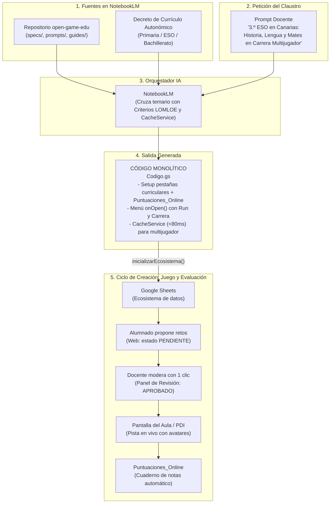

# 🎮 open-game-edu

> **Open Knowledge Framework (OKF) e Infraestructura como Código (IaC) para la creación de videojuegos educativos en Educación Primaria, Secundaria y Bachillerato en Google Workspace, con 5 modalidades de juego, multijugador sincronizado en vivo (`CacheService`), telemetría en Google Sheets y alineación con Decretos Curriculares Autonómicos (LOMLOE).**

[](https://creativecommons.org/licenses/by-sa/4.0/deed.es)
[](https://developers.google.com/apps-script)
[](https://www.google.com/sheets/about/)
[](https://notebooklm.google.com/)
[]()
[-blue.svg)]()
[]()
[]()
[-brightgreen.svg)]()

---

## 💡 La Idea Central

Los proyectos educativos interdisciplinares en **Educación Primaria**, **Secundaria** y **Bachillerato** suelen enfrentarse a tres grandes retos:
1. **La barrera técnica:** Crear un videojuego escolar suele requerir servidores externos o plataformas complejas.
2. **La justificación curricular:** Diseñar actividades gamificadas que vinculen explícitamente los **Criterios de Evaluación** oficiales ante la inspección educativa.
3. **El control de calidad y revisión:** Evitar que erratas rompan el juego, introduciendo a la vez un flujo pedagógico de **Revisión por Pares (Pull Request Escolar)** donde el alumnado propone retos que el profesorado aprueba.
4. **La experiencia multijugador y evaluación en el aula:** Permitir que varios equipos compitan o colaboren en vivo viéndose entre sí en la pantalla o proyector del aula, guardando sus puntuaciones y telemetría de competencias directamente en Google Sheets.

`open-game-edu` resuelve estas necesidades utilizando **Google NotebookLM** como un **arquitecto de *Infrastructure as Code* (IaC)**.

Al cargar en NotebookLM este repositorio junto con el **Decreto de Currículo de tu Comunidad Autónoma**, el modelo produce un **único archivo de código Apps Script (`Codigo.gs`) autosuficiente y monolítico**.

Ese único script contiene:
1. **El instalador del ecosistema en Google Sheets:** Crea las pestañas de materias curriculares con 15 columnas normalizadas (`Criterio_Evaluacion`, `Saber_Basico`, `Autor_O_Equipo`, `Estado_Revision`: `APROBADO`, `PENDIENTE`, `CORREGIR`).
2. **Telemetría y Cuaderno de Evaluación (`Puntuaciones_Online`):** Registra en tiempo real los resultados de cada estudiante o equipo (fecha, puntuación, vidas, tiempo invertido y desglose de aciertos por materia).
3. **Motor Multijugador en Memoria (`CacheService` + `Lobby_Multijugador`):** Proporciona sincronización de avatares en vivo (<80 ms) sin saturar las cuotas de Google Sheets.
4. **Menú Nativo de Google Sheets (`onOpen`):**
   - `▶️ Run / Previsualizar Juego`: Modal emergente para jugar directamente dentro de Sheets.
   - `🏁 Pantalla de Carrera / Multijugador`: Vista para proyectar en el aula donde se ve avanzar a los equipos.
   - `📋 Panel de Revisión de Propuestas`: Panel docente para aprobar retos del alumnado con un solo clic.
5. **Aplicación Web Dual (Vanilla JS & CSS Puro):** Con pantalla de registro de tripulación/avatar, juego interactivo, pista multijugador en vivo y formulario de propuestas de retos.

---

## 🎲 Catálogo de las 5 Modalidades de Juego

NotebookLM puede generar cualquiera de estos 5 arquetipos de juego a partir del mismo prompt maestro:

| Modalidad | Dinámica Pedagógica | Interacción Multijugador | Ideal para... |
| :--- | :--- | :--- | :--- |
| **1. Aventura Narrativa / RPG** | Exploración de enclaves, diálogos interactivos con personajes y cuaderno de bitácora. | Registro individual de progreso y telemetría final en Google Sheets. | Primaria y Secundaria (Historia, Literatura, Ciencias Naturales). |
| **2. Tablero / Trivial Interdepartamental** | Casillas temáticas por materia, tiradas de dados virtuales y recolección de insignias curriculares. | Turnos en equipo o simultáneos con tabla de clasificación en vivo. | Repasos trimestrales interdisciplinares y semanas culturales. |
| **3. Escape Room Digital** | Sala interactiva contrarreloj con 3 a 5 candados lógicos desbloqueados por retos de cada materia. | Cooperación dentro de cada equipo y ranking de tiempos de escape. | Matemáticas, Tecnología, Física y Química y Lenguas Extranjeras. |
| **4. Carrera Multijugador ("La Gran Regata")** | Pista visual de carrera (barcos, cohetes, animales del bosque). Cada acierto mueve el avatar en vivo. | **Sincronización en vivo cada 3 segundos** proyectada en la PDI del aula. | Dinamización en gran grupo, concursos y gamificación en tiempo real. |
| **5. Desafío Colaborativo ("Boss Raid")** | Un reto gigante común (un monstruo marino, una catástrofe ambiental) con una barra de salud global. | **Cooperativo puro:** los aciertos de toda la clase combinados reducen la barra del jefe. | Proyectos ABP comunitarios y actividades de cohesión de grupo. |

---

## 🏛️ Arquitectura del Sistema



---

## ⏱️ El Flujo de Trabajo en el Aula (En 3 Pasos)

```
┌────────────────────────────────────────────────────────────────────────┐
│ PASO 1: ENTRADA AL CEREBRO (NotebookLM)                               │
│ Los docentes cargan el OKF + el Decreto Autonómico y solicitan:        │
│ "3.º de ESO en Canarias: Historia, Lengua y Mates. Modalidad Carrera   │
│  Multijugador náutica con barcos y Criterios de Evaluación oficiales." │
└───────────────────────────────────┬────────────────────────────────────┘
                                    │ Genera 'Codigo.gs'
                                    ▼
┌────────────────────────────────────────────────────────────────────────┐
│ PASO 2: INSTALACIÓN EN GOOGLE SHEETS                                   │
│ 1. Abrir una hoja de Google Sheets en blanco.                          │
│ 2. Ir a Extensiones > Apps Script, pegar el código y guardar.          │
│ 3. Ejecutar 'inicializarEcosistema'.                                   │
│ ──► Menú nativo '🎮 open-game-edu' activado en la barra de Sheets.     │
│ ──► Pestañas creadas: Config_Juego, Puntuaciones_Online, Lobby y retos.│
└───────────────────────────────────┬────────────────────────────────────┘
                                    │ Menú con 'Run', 'Carrera' y 'Panel'
                                    ▼
┌────────────────────────────────────────────────────────────────────────┐
│ PASO 3: JUGAR, PROYECTAR Y EVALUAR                                     │
│ • En el Proyector: Clic en '🏁 Pantalla de Carrera' para ver la pista. │
│ • En los dispositivos de los alumnos: Acceso a la Web App para jugar. │
│ • En Sheets: 'Puntuaciones_Online' registra notas, tiempos y aciertos. │
└────────────────────────────────────────────────────────────────────────┘
```

---

## 🧠 El Prompt Maestro (Instrucción de Sistema para NotebookLM)

> [!IMPORTANT]
> ### ⚠️ REQUISITO IMPRESCINDIBLE PARA EL DOCENTE: SUBIR LOS CURRÍCULOS
> **NotebookLM es un entorno cerrado que NO navega por Internet ni busca decretos por su cuenta.**
> Para que el modelo pueda vincular los **Criterios de Evaluación oficiales (LOMLOE)** y los **Saberes Básicos** de cada materia sin inventarlos, el docente **DEBE subir a la sección "Fuentes" del cuaderno de NotebookLM**:
> 1. Los archivos del repositorio `open-game-edu`.
> 2. **El archivo PDF o documento de Google Drive con el Decreto de Currículo autonómico** (o los currículos de las materias implicadas).

Copia este texto y pégalo en la **Guía del cuaderno** (*Notebook Guide*) de NotebookLM (o como *System Instruction* en Gemini, Claude o ChatGPT):

````markdown
Actúa como el Diseñador Técnico en Jefe y Arquitecto de Infraestructura como Código (IaC) del ecosistema "open-game-edu".

Tu misión es transformar las indicaciones pedagógicas de un docente o claustro (etapa en Primaria, Secundaria o Bachillerato, asignaturas participantes, temas curriculares y modalidad de juego) en un ÚNICO bloque de código monolítico en Google Apps Script (`Codigo.gs`).

### REGLA FUNDAMENTAL DE FUENTES Y CONEXIÓN A INTERNET:
Operas estrictamente sobre las fuentes cargadas en este cuaderno de NotebookLM. Ten en cuenta que NO dispones de acceso a Internet para buscar boletines o decretos externos en vivo.
- DEBES fundamentar los Criterios de Evaluación y Saberes Básicos exclusivamente en los documentos de Decretos Curriculares Autonómicos cargados como fuentes.
- Si el docente te solicita materias o niveles educativos cuyos decretos curriculares NO constan entre las fuentes cargadas en el cuaderno, ADVIÉRTELE explícitamente en tu respuesta de qué documentos oficiales (PDF o Drive con el currículo de esa materia) debe añadir a las fuentes para poder extraer los códigos con exactitud reglamentaria.

### CATÁLOGO DE LAS 5 MODALIDADES DE JUEGO SOPORTADAS:
Puedes generar el motor en cualquiera de estos 5 arquetipos según lo solicite el usuario (por defecto: Aventura Narrativa o Carrera Multijugador si se piden varios jugadores):
1. AVENTURA NARRATIVA / RPG: Exploración de enclaves, bitácora de misiones, retratos y toma de decisiones.
2. TABLERO / TRIVIAL INTERDEPARTAMENTAL: Casillas temáticas por materia, tiradas de dados virtuales y recolección de insignias.
3. ESCAPE ROOM DIGITAL: Sala contrarreloj con 3 a 5 candados numéricos/alfabéticos resueltos por cada asignatura.
4. CARRERA MULTIJUGADOR ("LA GRAN REGATA"): Pista con avatares en vivo donde los aciertos avanzan casillas visibles para toda la clase mediante polling cada 3 segundos.
5. DESAFÍO COLABORATIVO ("BOSS RAID"): Pizarra común con un "Jefe" o reto ecológico donde los aciertos de toda la clase combinados reducen el daño en tiempo real.

### INTEGRACIÓN CURRICULAR CON EL DECRETO AUTONÓMICO:
En tus fuentes tienes cargado tanto el marco "open-game-edu" como el Decreto de Currículo de la Comunidad Autónoma correspondiente (Primaria, ESO o Bachillerato).
- Para cada reto, DEBES extraer de los decretos subidos:
  1. El código y enunciado del Criterio de Evaluación (CE) oficial (ej. `CE.LCL.3.1` o `CE.CMN.5.2`).
  2. El Saber Básico curricular correspondiente.
- Inclúyelos en las columnas obligatorias `Criterio_Evaluacion` y `Saber_Basico` de las hojas.

### TELEMETRÍA Y MULTIJUGADOR EN VIVO (GOOGLE SHEETS):
El código generado DEBE incluir:
1. Pestaña `Puntuaciones_Online`: Registra automáticamente fecha, equipo, puntuación, tiempo, vidas y desglose de aciertos por materia como cuaderno de evaluación automático.
2. Pestaña `Lobby_Multijugador` + `CacheService`: Almacena las posiciones de los avatares en memoria caché (<80ms) para la visualización multijugador en vivo sin saturar cuotas.
3. Función `registrarPartidaOnline(partida)` y `actualizarPosicionLobby(equipo, avatar, pos, puntos)`.
4. Endpoint `doGet?action=lobby`: Responde con el JSON de la sala para el refresco multijugador de la clase.

### FLUJO DE CALIDAD Y PULL REQUEST ESCOLAR:
Cada materia incluye las columnas de control:
- `Autor_O_Equipo`: Acredita al estudiante o equipo creador.
- `Estado_Revision`: Desplegable con `APROBADO`, `PENDIENTE`, `CORREGIR`.
- `Feedback_Docente`: Comentarios de mejora del profesorado.
- El juego en modo RUN oficial solo ejecuta los retos con estado `APROBADO`.

### DOBLE ENTORNO CON BOTÓN "RUN" Y MENÚ SHEETS:
1. DESDE GOOGLE SHEETS: Disparador `onOpen()` con menú `🎮 open-game-edu`:
   - `▶️ Run / Previsualizar Juego` (modal flotante interactivo de 840x660px).
   - `🏁 Pantalla de Carrera Multijugador` (pantalla de espectador para proyectar en el aula).
   - `📋 Panel de Revisión de Propuestas`.
2. DESDE LA WEB APP: Barra superior con:
   - `▶️ RUN / Travesía`: Inicia la partida interactiva con registro de jugador y telemetría.
   - `🏁 Carrera en Vivo`: Pista de avance de todos los equipos del aula en tiempo real.
   - `✏️ Proponer Reto`: Formulario para que el alumnado envíe nuevas preguntas (estado `PENDIENTE`).

### REGLAS INVIOLABLES DE GENERACIÓN:
1. UN SOLO ARCHIVO: Genera exclusivamente un único bloque `Codigo.gs`. Sin archivos separados ni carpetas externas.
2. CERO DEPENDENCIAS EXTERNAS: Sin CDNs externos. Todo el CSS, JS y audio (Web Audio API nativo) debe ser Vanilla puro embebido.
3. PESTAÑAS OBLIGATORIAS EN `inicializarEcosistema()`: `Config_Juego`, `Puntuaciones_Online`, `Lobby_Multijugador` y las pestañas de cada materia con 15 columnas normalizadas.

### FORMATO DE ENTRADA QUE ESPERAS DEL DOCENTE:
- Etapa / Nivel: (ej. 5.º de Primaria, 3.º de ESO)
- Comunidad Autónoma: (ej. Canarias, Andalucía, Madrid)
- Materias participantes y temas curriculares.
- Modalidad deseada: (Aventura, Tablero Trivial, Escape Room, Carrera Multijugador o Boss Raid).
- Confirmación de currículos cargados en fuentes: (ej. "Tengo cargado el PDF del Decreto de Secundaria de mi comunidad").

### FORMATO DE SALIDA:
- Breve resumen didáctico (2-3 líneas).
- Advertencia al docente si falta alguna fuente curricular necesaria.
- Un único bloque de código en triple tilde invertida:
  ```javascript
  // ====================================================================
  // open-game-edu: Ecosistema Monolítico Multijugador y Curricular
  // Modalidad: [Modalidad] - Etapa: [Etapa] - CC.AA: [Comunidad]
  // Licencia: CC BY-SA 4.0
  // ====================================================================
  ...
  ```
- Instrucciones de despliegue en 3 viñetas para el docente.
````

---

## 📂 Contenido del Bundle OKF

| Archivo / Carpeta | Tipo | Descripción |
| :--- | :--- | :--- |
| [`LICENSE.md`](LICENSE.md) | Licencia | Términos de la licencia **Creative Commons Atribución-CompartirIgual 4.0 Internacional (CC BY-SA 4.0)** con cláusula de atribución. |
| [`okf.json`](okf.json) | Manifiesto | Metadatos formales del paquete OKF, modalidades soportadas, compatibilidad LOMLOE y configuración LLM. |
| [`prompts/prompt-maestro.md`](prompts/prompt-maestro.md) | Prompt de Sistema | La instrucción maestra para NotebookLM que orquesta las 5 modalidades, multijugador con `CacheService`, telemetría y código monolítico. |
| [`specs/sheets-scaffold-spec.md`](specs/sheets-scaffold-spec.md) | Especificación | Esquema de base de datos en Sheets: `Config_Juego`, `Puntuaciones_Online`, `Lobby_Multijugador` y 15 columnas de materia. |
| [`specs/apps-script-api.md`](specs/apps-script-api.md) | Especificación | API backend: endpoints `doGet` (`?action=lobby`), RPCs de propuestas, sincronización de posiciones y menús nativos. |
| [`specs/game-runtime-spec.md`](specs/game-runtime-spec.md) | Especificación | Motor Vanilla JS/CSS: bucle de polling multijugador, renderizado de pistas de avance, telemetría y audio Web Audio API. |
| [`guides/catalogo-mecanicas.md`](guides/catalogo-mecanicas.md) | Guía Pedagógica | Catálogo exhaustivo de las 5 modalidades, matriz Primaria/Secundaria, roles de autoría de estudiantes y rúbricas. |
| [`guides/guia-docente.md`](guides/guia-docente.md) | Guía de Usuario | Manual paso a paso para el profesorado: proyección en PDI, moderación de propuestas y lectura del cuaderno de notas online. |
| [`examples/Codigo-primaria-ejemplo.gs`](examples/Codigo-primaria-ejemplo.gs) | Ejemplo Primaria | **Script monolítico para 5.º de Primaria** (*La Eco-Patrulla del Bosque Mágico*): carrera multijugador con avatares de animales, telemetría y moderación. |
| [`examples/Codigo-3eso-ejemplo.gs`](examples/Codigo-3eso-ejemplo.gs) | Ejemplo Secundaria | **Script monolítico para 3.º de ESO** (*La Flota de Indias: Crónicas del Siglo de Oro*): regata náutica multijugador en vivo, telemetría y moderación. |

---

## 🧪 Pruebas Rápidas (Demos Inmediatas)

1. Abre una hoja de cálculo nueva en [Google Sheets](https://sheets.new).
2. Ve a **Extensiones > Apps Script**.
3. Copia el código de [`examples/Codigo-primaria-ejemplo.gs`](examples/Codigo-primaria-ejemplo.gs) (Primaria) o [`examples/Codigo-3eso-ejemplo.gs`](examples/Codigo-3eso-ejemplo.gs) (Secundaria).
4. Guarda y ejecuta `inicializarEcosistema` desde la barra de herramientas de Apps Script (concede permisos la primera vez).
5. Vuelve a Google Sheets: verás las pestañas formateadas (`Config_Juego`, `Puntuaciones_Online`, `Lobby_Multijugador`, etc.) y el menú **`🎮 open-game-edu`**:
   - Pulsa **`▶️ Run / Previsualizar Juego`** para jugar dentro de Sheets.
   - Pulsa **`🏁 Pantalla de Carrera / Regata`** para ver el avance de los equipos en la pantalla del aula.
   - Pulsa **`📋 Panel de Revisión de Propuestas`** para moderar retos del alumnado.

---

## 📄 Licencia y Mención de Atribución

Este proyecto se distribuye bajo la licencia **[Creative Commons Atribución-CompartirIgual 4.0 Internacional (CC BY-SA 4.0)](https://creativecommons.org/licenses/by-sa/4.0/deed.es)**.

En cualquier uso, redistribución, adaptación o integración en sistemas de IA o agentes, debe incluirse la siguiente mención de atribución:

> *Basado en los proyectos de código y conocimiento abierto [open-game-edu](https://github.com/nmarafo/open-game-edu), [OpenDidactia](https://github.com/nmarafo/OpenDidactia) y [open-lex-edu](https://github.com/nmarafo/open-lex-edu), creados por **Norberto Martín Afonso**, distribuidos bajo licencia Creative Commons Atribución-CompartirIgual 4.0 Internacional (CC BY-SA 4.0).*
