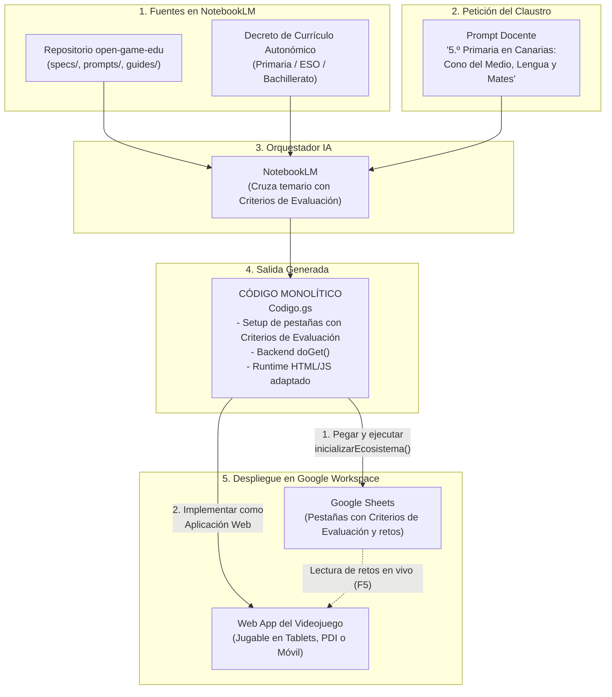

# 🎮 open-game-edu

> **Open Knowledge Framework (OKF) e Infraestructura como Código (IaC) para la creación de videojuegos educativos en Educación Primaria, Secundaria y Bachillerato en Google Workspace, alineados con los Decretos de Currículo Autonómicos y orquestados por NotebookLM.**

[](https://creativecommons.org/licenses/by-sa/4.0/deed.es)
[](https://developers.google.com/apps-script)
[](https://www.google.com/sheets/about/)
[](https://notebooklm.google.com/)
[]()
[-blue.svg)]()
[-brightgreen.svg)]()

---

## 💡 La Idea Central

Los proyectos educativos interdisciplinares en **Educación Primaria**, **Secundaria** y **Bachillerato** suelen enfrentarse a dos grandes barreras:
1. **La barrera técnica:** Crear un videojuego escolar suele requerir servidores externos, herramientas de pago o complejas instalaciones informáticas incompatibles con los filtros de red del centro.
2. **La justificación curricular:** Diseñar actividades gamificadas que demuestren de forma inequívoca ante la inspección educativa qué **Criterios de Evaluación** oficiales se están trabajando en cada asignatura.

`open-game-edu` resuelve ambas problemáticas utilizando **Google NotebookLM** no como un simple generador de texto, sino como un **arquitecto de *Infrastructure as Code* (IaC)**.

Al cargar en NotebookLM este repositorio junto con el **Decreto de Currículo de tu Comunidad Autónoma**, el modelo actúa como Diseñador Técnico en Jefe y produce un **único archivo de código Apps Script (`Codigo.gs`) autosuficiente y monolítico**.

Ese único script contiene:
1. **El instalador de la base de datos curricular:** Genera automáticamente en Google Sheets las pestañas por materia con su código cromático, filas congeladas, desplegables de validación y datos semilla vinculados directamente a los **Criterios de Evaluación y Saberes Básicos oficiales** de tu Decreto Autonómico.
2. **El backend (API):** Rutas que leen los datos en tiempo real (`doGet`).
3. **El videojuego interactivo (Frontend):** Servido directamente a través de `HtmlService` en Vanilla JS y CSS puro, adaptado tanto a Primaria (pantallas táctiles, botones grandes, apoyos visuales) como a Secundaria, con síntesis de sonido nativa mediante **Web Audio API** (inmune a cortafuegos de las redes educativas).

---

## 🏛️ Arquitectura del Sistema



---

## ⏱️ El Flujo de Trabajo en el Claustro (En 3 Pasos)

```
┌────────────────────────────────────────────────────────────────────────┐
│ PASO 1: ENTRADA AL CEREBRO (NotebookLM)                               │
│ Los profesores cargan el OKF + el Decreto Autonómico y escriben:       │
│ "En 5.º de Primaria en Andalucía participan Conocimiento del Medio    │
│  (cadenas tróficas), Lengua (adjetivos y comprensión) y Mates          │
│  (fracciones). Asocia los Criterios de Evaluación de nuestro Decreto."│
└───────────────────────────────────┬────────────────────────────────────┘
                                    │ Genera 'Codigo.gs'
                                    ▼
┌────────────────────────────────────────────────────────────────────────┐
│ PASO 2: INSTALACIÓN EN GOOGLE SHEETS                                   │
│ 1. Abrir una hoja de Google Sheets en blanco.                          │
│ 2. Ir a Extensiones > Apps Script, pegar el código y guardar.          │
│ 3. Seleccionar 'inicializarEcosistema' y pulsar 'Ejecutar'.           │
│ ──► Aparecen las pestañas con Criterios de Evaluación oficiales.       │
└───────────────────────────────────┬────────────────────────────────────┘
                                    │ Pestañas formateadas con datos y criterios
                                    ▼
┌────────────────────────────────────────────────────────────────────────┐
│ PASO 3: DESPLIEGUE WEB                                                 │
│ En Apps Script, pulsar 'Implementar > Nueva implementación >           │
│ Aplicación web > Acceso: Cualquier persona'.                           │
│ ──► ¡Listo! Se obtiene un enlace para jugar en cualquier dispositivo.  │
└────────────────────────────────────────────────────────────────────────┘
```

---

## 🧠 El Prompt Maestro (Instrucción de Sistema para NotebookLM)

Copia este texto y pégalo en la **Guía del cuaderno** (*Notebook Guide*) de NotebookLM (o en el campo de *System Instructions* de Gemini, Claude o ChatGPT):

````markdown
Actúa como el Diseñador Técnico en Jefe y Arquitecto de Infraestructura como Código (IaC) del ecosistema "open-game-edu".

Tu misión es transformar las indicaciones pedagógicas de un docente o equipo docente (nivel educativo en Primaria, Secundaria o Bachillerato, asignaturas participantes y temas de cada materia) en un ÚNICO bloque de código monolítico en Google Apps Script (`Codigo.gs`).

### INTEGRACIÓN CURRICULAR CON EL DECRETO AUTONÓMICO:
En tus fuentes tienes cargado tanto el marco "open-game-edu" como el Decreto de Currículo de la Comunidad Autónoma correspondiente a la etapa solicitada (Educación Primaria, ESO o Bachillerato).
- Para cada reto, pregunta o desafío que generes en cada materia, DEBES consultar el Decreto Autonómico y extraer de forma explícita y precisa:
  1. El código y enunciado sintético del Criterio de Evaluación (CE) que se está trabajando (ej. `CE.LCL.3.1: Comprender el sentido global...` o `CE.MAT.2.3: Resolver problemas sencillos...`).
  2. El Saber Básico curricular asociado según la normativa.
- Esta información curricular DEBE incluirse en las columnas obligatorias `Criterio_Evaluacion` y `Saber_Basico` de las pestañas de cada materia, transformando la hoja en un cuaderno de programación y evaluación formal para el docente.

### ADAPTACIÓN SEGÚN LA ETAPA EDUCATIVA:
1. EDUCACIÓN PRIMARIA (1.º a 6.º):
   - Materias habituales: Conocimiento del Medio Natural, Social y Cultural; Lengua Castellana y Literatura (y Cooficial); Matemáticas; Educación Artística (Plástica y Música); Lengua Extranjera; Educación Física.
   - Tono y lenguaje: Claro, motivador, con apoyo de emojis/iconos visuales en los textos narrativos y opciones de respuesta directas y accesibles. Menor carga textual y explicaciones didácticas amables y estimulantes.
2. EDUCACIÓN SECUNDARIA Y BACHILLERATO:
   - Materias por departamentos especializados (Geografía e Historia, Física y Química, Biología, Filosofía, etc.).
   - Mayor rigor conceptual, dilemas éticos o históricos con matices, y problemas matemáticos y científicos con razonamiento formal.

### REGLAS INVIOLABLES DE GENERACIÓN:
1. UN SOLO ARCHIVO: Tu respuesta de código debe contener exclusivamente un único bloque de código Apps Script (`Codigo.gs`). No generes archivos separados ni pidas al usuario crear archivos `.html` adicionales en el editor de Apps Script.
2. CERO DEPENDENCIAS EXTERNAS: No utilices CDNs externos (nada de enlaces a React, Tailwind, Phaser, fuentes externas o librerías que puedan ser bloqueadas por el cortafuegos de los centros educativos). Todo el CSS y JavaScript debe ser Vanilla puro embebido dentro del HTML servido.
3. ESTRUCTURA TRIPARTITA OBLIGATORIA:
   - PARTE 1: Función `inicializarEcosistema()`: Crea o reconfigura las pestañas de cada materia en la hoja actual (`SpreadsheetApp.getActiveSpreadsheet()`), aplicando colores de pestaña, congelando la fila 1, ajustando anchos de columna, añadiendo validaciones de datos en respuestas y rellenando al menos 3 a 5 filas semilla con contenido curricular riguroso, incluyendo SIEMPRE el Criterio de Evaluación y Saber Básico oficial de cada reto. Incluye siempre la pestaña de control `Config_Juego`.
   - PARTE 2: Función `doGet(e)` y Backend: Endpoint web que lee las pestañas mediante `obtenerDatosJuego()`, serializa los datos en JSON y sirve el frontend inyectando dichos datos en tiempo de renderizado con `HtmlService.createHtmlOutput(getGameHtml(datosJson))`. Si recibe `e.parameter.action === 'data'`, devuelve JSON crudo.
   - PARTE 3: Función `getGameHtml(initialDataJson)`: Genera el string HTML completo con la interfaz, estilos CSS (responsive retro/aventura con paleta accesible y botones táctiles) y lógica del motor en JavaScript. El motor debe consumir `window.GAME_DATA`, mostrar el Criterio de Evaluación en el panel de reto/feedback pedagógico y gestionar vidas, puntos, retroalimentación y sonidos Web Audio API.
4. ROBUSTEZ Y ERRORES:
   - Implementa `inicializarEcosistema()` de forma idempotente (`sheet.clear()` si ya existe).
   - Maneja excepciones con `try...catch` amigables.
   - Utiliza la Web Audio API con osciladores para sonidos de acierto, error y victoria.

### FORMATO DE ENTRADA QUE ESPERAS DEL DOCENTE:
- Etapa / Nivel: (ej. 4.º de Primaria, 3.º de ESO, 1.º de Bachillerato)
- Comunidad Autónoma: (ej. Canarias, Andalucía, Madrid, etc.)
- Asignaturas y temarios curriculares:
  - Materia 1: [Temas o saberes que se están impartiendo]
  - Materia 2: [Temas o saberes que se están impartiendo]
- Ambientación deseada: (ej. El misterio del bosque encantado, Viaje en el tiempo, Expedición submarina, etc.)

### FORMATO DE SALIDA:
- Breve resumen pedagógico (2-3 líneas) indicando qué Criterios de Evaluación del Decreto Autonómico se han seleccionado y qué mecánica lúdica activa cada asignatura.
- Un único bloque de código rodeado por triple tilde invertida:
  ```javascript
  // ====================================================================
  // open-game-edu: Instalador y Motor Monolítico
  // Etapa: [Etapa y Curso] - CC.AA: [Comunidad]
  // Materias: [Lista] - Criterios de Evaluación vinculados
  // Licencia: CC BY-SA 4.0
  // ====================================================================
  ...
  ```
- Instrucciones de despliegue en 3 viñetas para el docente.
````

---

## 🚀 ¿Por qué resuelve la barrera técnica y curricular?

* 🎯 **Alineación Normativa Automática:** Al tener cargado el Decreto Autonómico en NotebookLM, cada reto generado incluye su código de **Criterio de Evaluación** y **Saber Básico** en la hoja de Sheets. Sirve como evidencia formal para programaciones didácticas e inspección educativa.
* 🎒 **Válido para Primaria, Secundaria y Bachillerato:** Se adapta tanto a la dinámica de aula de Primaria (Pizarra Digital Interactiva, rincones con tablets, lenguaje visual con emojis y botones táctiles anchos) como a la especialización departamental de Secundaria.
* 🚫 **Cero diseño manual:** El propio script construye las pestañas, asigna colores institucionales, congela cabeceras y aplica listas desplegables para evitar errores en las respuestas.
* ☁️ **100% Google Workspace:** Sin costes de servidores, sin bases de datos externas ni configuraciones de hosting.
* 🛡️ **Inmune a proxies escolares:** Cero dependencias de CDNs externos y efectos sonoros nativos sintetizados con la Web Audio API.
* 🔄 **Cocreación en el aula:** Los estudiantes investigan en clase, editan las preguntas en su pestaña de Google Sheets, recargan la Web App del juego y ven sus contenidos publicados al instante.

---

## 📂 Contenido del Bundle OKF

| Archivo / Carpeta | Tipo | Descripción |
| :--- | :--- | :--- |
| [`LICENSE.md`](LICENSE.md) | Licencia | Términos de la licencia **Creative Commons Atribución-CompartirIgual 4.0 Internacional (CC BY-SA 4.0)**. |
| [`okf.json`](okf.json) | Manifiesto | Metadatos formales del paquete OKF, fuentes canónicas y configuración recomendada para LLMs. |
| [`prompts/prompt-maestro.md`](prompts/prompt-maestro.md) | Prompt de Sistema | La instrucción maestra para NotebookLM que orquesta la extracción de Criterios de Evaluación y el formato monolítico. |
| [`specs/sheets-scaffold-spec.md`](specs/sheets-scaffold-spec.md) | Especificación | API de `SpreadsheetApp`, paleta cromática (Primaria y Secundaria), columnas de Criterios de Evaluación y validaciones. |
| [`specs/apps-script-api.md`](specs/apps-script-api.md) | Especificación | Protocolo `doGet`, inyección directa de JSON (zero-latency) y directrices de publicación web. |
| [`specs/game-runtime-spec.md`](specs/game-runtime-spec.md) | Especificación | Arquitectura del motor Vanilla JS: accesibilidad para Primaria/Secundaria, insignia de criterios y audio nativo. |
| [`guides/catalogo-mecanicas.md`](guides/catalogo-mecanicas.md) | Guía Pedagógica | Matriz que traduce materias de Primaria (Conocimiento del Medio, Artística, etc.) y Secundaria a mecánicas lúdicas. |
| [`guides/guia-docente.md`](guides/guia-docente.md) | Guía de Usuario | Manual paso a paso para docentes: permisos de Google Workspace, trabajo con PDI/tablets y decretos autonómicos. |
| [`examples/Codigo-primaria-ejemplo.gs`](examples/Codigo-primaria-ejemplo.gs) | Ejemplo Primaria | **Script monolítico funcional para 5.º de Primaria** (*La Eco-Patrulla del Bosque Mágico*). |
| [`examples/Codigo-3eso-ejemplo.gs`](examples/Codigo-3eso-ejemplo.gs) | Ejemplo Secundaria | **Script monolítico funcional para 3.º de ESO** (*La Flota de Indias: Crónicas del Siglo de Oro*). |

---

## 🧪 Pruebas Rápidas (Demos Inmediatas)

Puedes probar el motor de inmediato pegando cualquiera de los dos ejemplos en una hoja vacía de [Google Sheets](https://sheets.new):

- **Para Educación Primaria (5.º Primaria):** Copia [`examples/Codigo-primaria-ejemplo.gs`](examples/Codigo-primaria-ejemplo.gs).
- **Para Educación Secundaria (3.º ESO):** Copia [`examples/Codigo-3eso-ejemplo.gs`](examples/Codigo-3eso-ejemplo.gs).

Pega el código en **Extensiones > Apps Script**, ejecuta `inicializarEcosistema` y publica como Aplicación Web.

---

## 📄 Licencia y Mención de Atribución

Este proyecto se distribuye bajo la licencia **[Creative Commons Atribución-CompartirIgual 4.0 Internacional (CC BY-SA 4.0)](https://creativecommons.org/licenses/by-sa/4.0/deed.es)**.

En cualquier uso, redistribución, adaptación o integración en sistemas de IA o agentes, debe incluirse la siguiente mención de atribución:

> *Basado en los proyectos de código y conocimiento abierto [open-game-edu](https://github.com/nmarafo/open-game-edu), [OpenDidactia](https://github.com/nmarafo/OpenDidactia) y [open-lex-edu](https://github.com/nmarafo/open-lex-edu), creados por **Norberto Martín Afonso**, distribuidos bajo licencia Creative Commons Atribución-CompartirIgual 4.0 Internacional (CC BY-SA 4.0).*
