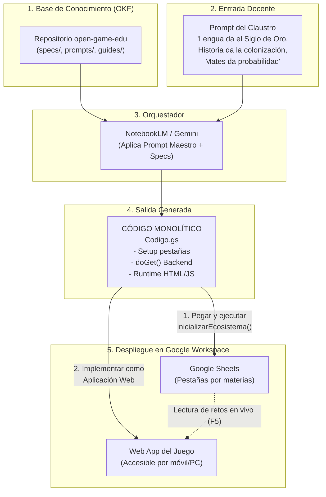

# 🎮 open-game-edu

> **Open Knowledge Framework (OKF) e Infraestructura como Código (IaC) para la creación de videojuegos educativos interdepartamentales en Google Workspace, orquestado por NotebookLM.**

[](https://opensource.org/licenses/MIT)
[](https://developers.google.com/apps-script)
[](https://www.google.com/sheets/about/)
[](https://notebooklm.google.com/)
[-brightgreen.svg)]()

---

## 💡 La Idea Central

Los proyectos educativos interdisciplinares en Secundaria y Bachillerato suelen toparse con una barrera técnica infranqueable: **crear un videojuego requiere servidores, conocimientos avanzados de programación o plataformas de pago complejas**.

`open-game-edu` resuelve este problema utilizando **Google NotebookLM** no como un simple chat, sino como un **arquitecto de *Infrastructure as Code* (IaC)**. 

NotebookLM no necesita pulsar botones en Google Drive ni ejecutar código en la nube: gracias a la base de conocimiento estandarizada (OKF) de este repositorio, el modelo genera un **único archivo de código Apps Script (`Codigo.gs`) autosuficiente y monolítico**.

Ese único script contiene:
1. **El instalador de la base de datos:** Al ejecutarse una sola vez en una hoja vacía de Google Sheets, genera automáticamente las pestañas por materia con colores, anchos de columna, cabeceras, validaciones desplegables y datos semilla alineados con el currículo.
2. **El backend (API):** Rutas que leen los datos en tiempo real y sirven la información.
3. **El videojuego (Frontend):** Servido a través de `HtmlService` en Vanilla JS y CSS puro, con síntesis de sonido mediante la **Web Audio API** y cero librerías externas (inmune a los bloqueos de firewall en las redes de los centros escolares).

---

## 🏛️ Arquitectura del Sistema



---

## ⏱️ El Flujo de Trabajo en el Claustro (En 3 Pasos)

Para el equipo docente, el proceso dura menos de 2 minutos:

```
┌────────────────────────────────────────────────────────────────────────┐
│ PASO 1: ENTRADA AL CEREBRO (NotebookLM)                               │
│ Los profesores escriben en el cuaderno:                                │
│ "En 3.º de ESO participan Lengua (Siglo de Oro y teatro), Historia    │
│  (comercio atlántico s. XVI) y Mates (probabilidad y fracciones).     │
│  Genera el instalador del juego."                                     │
└───────────────────────────────────┬────────────────────────────────────┘
                                    │ Genera 'Codigo.gs'
                                    ▼
┌────────────────────────────────────────────────────────────────────────┐
│ PASO 2: INSTALACIÓN EN GOOGLE SHEETS                                   │
│ 1. Abrir una hoja de Google Sheets en blanco.                          │
│ 2. Ir a Extensiones > Apps Script, pegar el código y guardar.          │
│ 3. Seleccionar 'inicializarEcosistema' y pulsar 'Ejecutar'.           │
│ ──► Aparecen las pestañas: Lengua_Teatro, Historia_Rutas, Mates_...   │
└───────────────────────────────────┬────────────────────────────────────┘
                                    │ Pestañas listas con datos y formato
                                    ▼
┌────────────────────────────────────────────────────────────────────────┐
│ PASO 3: DESPLIEGUE WEB                                                 │
│ En Apps Script, pulsar 'Implementar > Nueva implementación >           │
│ Aplicación web > Acceso: Cualquier persona'.                           │
│ ──► ¡Listo! Se obtiene un enlace para jugar en cualquier dispositivo.  │
└────────────────────────────────────────────────────────────────────────┘
```

---

## 🚀 ¿Por qué resuelve la barrera técnica docente?

* 🚫 **No hay que diseñar la hoja a mano:** El propio script la construye, le da color institucional por materia, congela cabeceras y añade desplegables de validación.
* ☁️ **Todo dentro de Google Workspace:** No hace falta contratar servidores, configurar GitHub Pages, comprar dominios ni instalar programas en las aulas de informática. Corre bajo las cuentas corporativas del centro educativo.
* 🛡️ **Cero bloqueos de red:** No utiliza CDNs externos que los filtros de seguridad de las consejerías de educación puedan bloquear. Los sonidos son sintetizados en el momento mediante Web Audio API nativa.
* 🔄 **Totalmente maleable por el alumnado:** En clase de Lengua o Matemáticas, los estudiantes investigan, abren su pestaña compartida en Sheets, escriben nuevos retos o corrigen datos, recargan la Web App del juego y **ven sus cambios reflejados al instante**.

---

## 📂 Contenido del Bundle OKF

| Archivo / Carpeta | Tipo | Descripción |
| :--- | :--- | :--- |
| [`okf.json`](okf.json) | Manifiesto | Metadatos formales del paquete OKF, fuentes canónicas y configuración recomendada para LLMs. |
| [`prompts/prompt-maestro.md`](prompts/prompt-maestro.md) | Prompt de Sistema | La instrucción maestra que fija el rol de Diseñador Técnico en Jefe en NotebookLM. |
| [`specs/sheets-scaffold-spec.md`](specs/sheets-scaffold-spec.md) | Especificación | API de `SpreadsheetApp`, paleta cromática por materia, validación y esquemas de columnas. |
| [`specs/apps-script-api.md`](specs/apps-script-api.md) | Especificación | Protocolo `doGet`, inyección zero-latency de JSON en el HTML y pautas de publicación web. |
| [`specs/game-runtime-spec.md`](specs/game-runtime-spec.md) | Especificación | Arquitectura del motor Vanilla JS, máquina de estados, sonido por oscilador y accesibilidad. |
| [`guides/catalogo-mecanicas.md`](guides/catalogo-mecanicas.md) | Guía Pedagógica | Matriz que traduce cualquier asignatura de Secundaria o Bachillerato a mecánicas jugables. |
| [`guides/guia-docente.md`](guides/guia-docente.md) | Guía de Usuario | Manual visual paso a paso para docentes: permisos, trabajo colaborativo y despliegue. |
| [`examples/Codigo-3eso-ejemplo.gs`](examples/Codigo-3eso-ejemplo.gs) | Código de Referencia | **Script completo y funcional para 3.º de ESO** listo para probar inmediatamente. |

---

## 🧪 Prueba Rápida (Demo Inmediata)

¿Quieres comprobar cómo funciona antes de conectarlo a NotebookLM?

1. Abre una hoja de cálculo nueva en [Google Sheets](https://sheets.new).
2. Ve a **Extensiones > Apps Script**.
3. Copia todo el contenido del archivo [`examples/Codigo-3eso-ejemplo.gs`](examples/Codigo-3eso-ejemplo.gs) y pégalo en el editor.
4. Haz clic en **Guardar** y luego en **Ejecutar** con la función `inicializarEcosistema`.
5. Ve a **Implementar > Nueva implementación > Aplicación web** y pulsa **Implementar**.
6. Abre el enlace generado y disfruta de la aventura *La Flota de Indias*.

---

## 📖 Cómo cargar este OKF en NotebookLM

1. Accede a [Google NotebookLM](https://notebooklm.google.com).
2. Crea un nuevo cuaderno (ej. *"Generador de Videojuegos Escolares"*).
3. Añade como **Fuentes** los archivos de este repositorio:
   - Sube los archivos `.md` de `specs/`, `prompts/` y `guides/`, o añade la URL de este repositorio.
4. En la **Guía del cuaderno** (o en la barra de chat), pega el contenido de [`prompts/prompt-maestro.md`](prompts/prompt-maestro.md).
5. ¡Empieza a describir los temas de tu claustro y obtén tu juego al instante!

---

## 📄 Licencia

Este proyecto está bajo la Licencia **MIT**. Eres libre de usarlo, adaptarlo y compartirlo en cualquier centro educativo, congreso de innovación o red docente.
